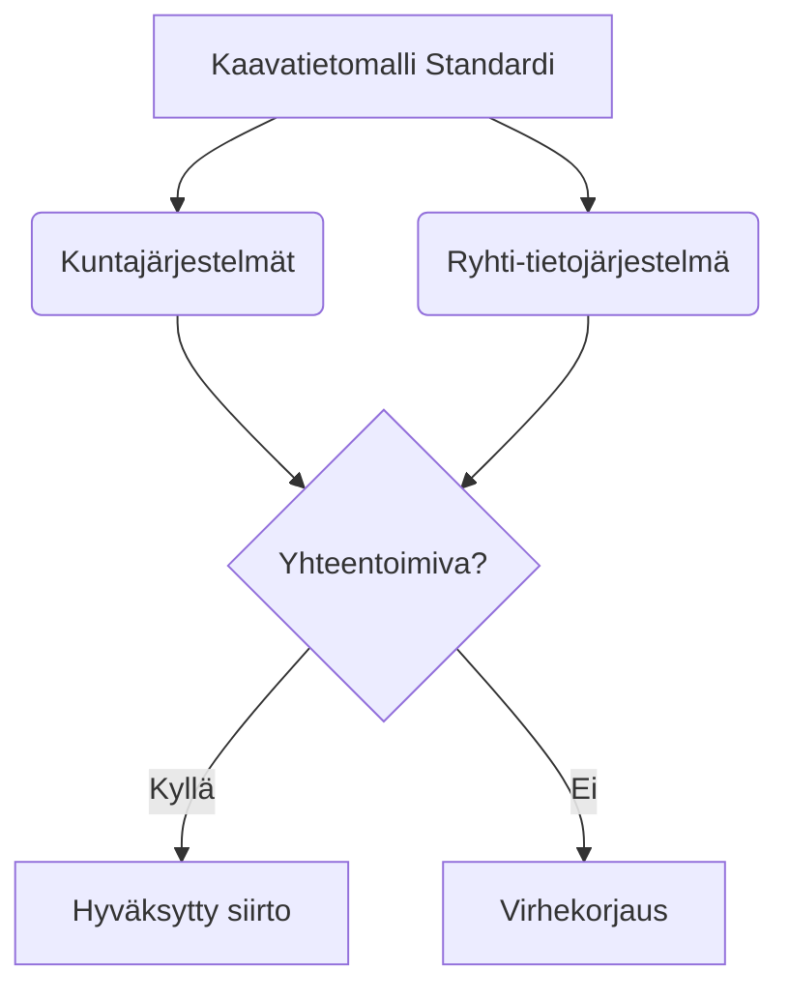

# Kaavatietomalli.fi

A highly polished, serverless headless CMS website built with React, Vite, and Tailwind CSS. The platform serves as a modern landing page, blog, and documentation archive for Finland's unified spatial planning data model (*kaavatietomalli*).

---

## Table of Contents
1. [Core CMS Operating Process](#core-cms-operating-process)
2. [Content Provider & Editorial Guide](#content-provider--editorial-guide)
   - [Structure of Content Directories](#1-structure-of-content-directories)
   - [Drafts vs. Scheduled Blog Posts](#2-drafts-vs-scheduled-blog-posts)
   - [Global Navigation & Theme Mapping](#3-global-navigation--theme-mapping)
   - [Content Contribution Workflow](#4-content-contribution-workflow)
   - [Advanced Rich Content Features](#5-advanced-rich-content-features)
   - [Testing & Validating Your Content](#6-testing--validating-your-content)
   - [Automated Nightly Publishing Pipeline](#7-automated-nightly-publishing-pipeline)
3. [Project & Code Architecture](#project--code-architecture)
4. [Testing Implementation & Developer Guidance](#testing-implementation--developer-guidance)
   - [Architectural Patterns & Component Isolation](#1-architectural-patterns--component-isolation)
   - [Unit & Integration Testing (Vitest + RTL)](#3-unit--integration-testing-vitest--rtl)
   - [End-to-End Testing (Playwright)](#5-end-to-end-testing-playwright)
   - [Test Content & Local-Test Variants](#6-test-content--local-test-variants)
5. [Contribution Guidelines](#contribution-guidelines)
6. [Development & Build Commands](#development--build-commands)

---

## Core CMS Operating Process

The platform operates as a **git-backed serverless developer CMS**. It requires zero database instances or complex backend runtimes. Instead, it relies on static file generation and indexing during the build phase to yield ultra-fast loads, robust offline capabilities, and maximum security.

```
       [ Markdown Content ] (.md files in /content)
                │
                ▼ (npm run prebuild)
   ┌─────────────────────────────────────────────────────────┐
   │  Ingestion scripts index content, generate metadata,     │
   │  compile search indices & fetch external Giscus stats.   │
   └─────────────────────────────────────────────────────────┘
                │
                ├────────────────────────┬────────────────────────┐
                ▼                        ▼                        ▼
     [ Static Asset Blobs ]     [ Search Index ]        [ Giscus Cache ]
     (public/content/*.json)   (public/search-index)    (public/giscus.json)
                │                        │                        │
                └────────────────────────┼────────────────────────┘
                                         ▼ (Deploy to static hosting / CDN)
                              ┌─────────────────────┐
                              │ Cloud Run CONTAINER │
                              └─────────────────────┘
                                         │
                                         ▼ (On-Demand Client Fetches)
                                  [ User Browser ]
                                (SPA React Engine)
```

1. **Markdown-Based Content Source**: Fully structured Markdown files in `/content` store blog posts, static pages, tags, and biographies.
2. **Build-Time Ingestion (`npm run prebuild`)**:
   - `scripts/generate-assets.ts`: Extracts frontmatter yaml configurations and body paragraphs into structured JSON assets within `/public/content/`.
   - `scripts/generate-search-index.ts`: Builds or registers a full-text client searchable schema into the Orama package.
   - `scripts/fetch-giscus-stats.ts`: Crawls discussions and retrieves comment indicators ahead of runtime presentation.
3. **Pre-Rendered On-Demand Access**: The React SPA parses and queries these local static files and compiled search databases sequentially on-demand using native lightweight HTTP `fetch` requests as users browse views.

---

## Content Provider & Editorial Guide

This section is designed specifically for **Content Providers and Editors** who maintain the website's articles, pages, images, and navigation menus. You do not need deep software development skills to manage content, but a basic understanding of Markdown and Git/GitHub is assumed.

### 1. Structure of Content Directories

All website content is stored as flat files inside the `/content` directory in the repository:

* **Blog Posts (`/content/posts/`)**:
  - Individual articles written in Markdown (`.md`).
  - Organized directly in the folder or inside year-based subdirectories (e.g., `/content/posts/blog/2026/my-post.md`).
  - Each post must contain YAML frontmatter at the very top (fenced by `---` lines) to declare title, publication date, author slug, tags, and excerpt.
* **Static Pages (`/content/pages/`)**:
  - Main info pages of the website (e.g., laws & regulations, data models, about page).
  - Also in Markdown (`.md`) format with required YAML frontmatter (e.g., `title`).
* **Author Biographies (`/content/authors/`)**:
  - Short biographies for the authors of blog posts.
  - Linked to posts via the author's slug (the filename without `.md`, like `ilkka-rinne`).
* **Images (`/content/images/`)**:
  - Store post-specific illustrations, diagrams, SVGs, or custom graphics here. 
  - Accessible on the front-end using standard markdown image paths or absolute paths.

---

### 2. Drafts vs. Scheduled Blog Posts

To provide editorial flexibility, the platform offers built-in support for **Drafts** and **Scheduled Posts**:

#### A. Draft Posts & Pages
If you are working on a piece of content that is not ready for the public, add `draft: true` to the YAML frontmatter at the top of your Markdown file:
```yaml
---
title: "My Work-in-Progress Article"
date: "2026-07-24"
author: "ilkka-rinne"
excerpt: "A draft article under development."
tags: ["tietomallit"]
draft: true
---
```
* **Behavior**: The build system completely filters out and ignores any files marked with `draft: true`. They will not be compiled, indexed in search, or deployed to production.

#### B. Scheduled Posts
You can write posts in advance and schedule them to be published automatically at a specific date and time by setting the `publishDate` metadata property:
```yaml
---
title: "Announcing a Future Standard"
date: "2026-08-01"
author: "ilkka-rinne"
excerpt: "This post will be automatically visible to readers on August 1st."
tags: ["tietomallit"]
publishDate: "2026-08-01T00:00:00Z"
---
```
* **Behavior**:
  - **In-dev previews / Builds**: If `publishDate` is set in the future relative to the client's current date, the article is hidden from search and listings on the live site.
  - **Nightly publishing**: An automated workflow runs every night (see [Automated Nightly Publishing Pipeline](#7-automated-nightly-publishing-pipeline) below) to check if any scheduled post's `publishDate` has passed. When it does, the workflow automatically triggers a fresh deployment, making the post live on the site.

---

### 3. Global Navigation & Theme Mapping

The file `/content/content-config.json` acts as the website's central editorial dashboard. It lets you manage:
1. **The Navigation Menu (`nav`)**:
   - Order, labels, and links of items appearing in the header navigation menu.
   - Supports static pages, tag pages, external links, and dropdown submenus.
2. **Themes & Tags (`themes`)**:
   - Lists main tags (e.g. `lainsäädäntö`, `tietomallit`) and maps them to human-readable names and visual labels.

To modify the navigation or add a submenu, simply edit `/content/content-config.json` directly. No developer code modifications are needed.

---

### 4. Content Contribution Workflow

Content updates are managed via standard GitHub Issues and Pull Requests to maintain quality and prevent accidental typos or broken formatting from making it onto the live site:

1. **Start with an Issue**:
   - Open a GitHub Issue explaining what content is being added or updated (e.g. "Add blog post about July Ryhti updates").
2. **Create your Working Branch**:
   - Pull the latest changes from the master branch (`git checkout main` and `git pull`).
   - Create a content-specific branch: `git checkout -b content/july-ryhti-updates`.
3. **Draft your Content**:
   - Create or edit your Markdown files, add images, and update configs as needed.
4. **Locally Test your Content**:
   - Run the local content validator command (see [Testing & Validating Your Content](#5-testing--validating-your-content)) to check for errors before pushing.
5. **Push and Open a Pull Request (PR)**:
   - Push your branch to GitHub: `git push origin content/july-ryhti-updates`.
   - Open a Pull Request targeting the `main` branch. Link it to your original GitHub Issue.
6. **Automated Review & Approval**:
   - Continuous Integration (GitHub Actions) runs automated checks on your PR.
   - Another team member reviews the content.
   - Once approved and merged, the changes are automatically built and deployed to production.

---

### 5. Advanced Rich Content Features

To make the documentation and blog posts highly engaging, the platform provides first-class support for interactive and rich content elements. You can embed videos, render process/structural diagrams, and insert fully interactive spatial planning maps directly using standard Markdown code blocks.

#### A. Embedded Video Blocks (`youtube` & `vimeo`)
If you need to embed videos, use the custom ````youtube```` or ````vimeo```` code blocks. Do not use standard HTML iframe codes; the CMS renders these blocks securely and adaptively:

```markdown
```youtube
id: "dQw4w9WgXcQ"
title: "My custom video title"
aspectRatio: "16:9"
```


* **Supported properties**:
  - `id` (Required): The YouTube or Vimeo video identifier (e.g., `dQw4w9WgXcQ`).
  - `title` (Optional): Descriptive title for accessibility.
  - `aspectRatio` (Optional): Aspect ratio string (e.g., `"16:9"` or `"4:3"`, defaults to `"16:9"`).

---

#### B. Mermaid Diagrams (`mermaid`)
You can draft flowcharts, process models, sequence diagrams, and state machines in plain text. Any code block declared with ````mermaid```` is automatically rendered as an interactive vector SVG diagram:

```markdown



* **Supported diagram types**:
  - Flowcharts (`graph TD` or `graph LR`)
  - Sequence Diagrams (`sequenceDiagram`)
  - Class Diagrams (`classDiagram`)
  - State Diagrams (`stateDiagram-v2`)
  - Entity Relationship Diagrams (`erDiagram`)
  - GANTT Diagrams (`gantt`)
  - Pie Charts (`pie`)
  - Mind maps (`mindmap`)

* **Pro-tip**: Ensure text inside shapes is descriptive and concise.

---

#### C. Interactive Spatial Maps (`geojson` & `jsonfg`)
Because spatial planning data (*kaavatietomalli*) is geographical, the website includes an interactive Leaflet map viewer. You can embed spatial geometries directly in your Markdown using either standard **GeoJSON** or **JSON-FG** (the modern OGC standard with improved Coordinate Reference System support):

##### GeoJSON Example:
```markdown
```geojson
{
  "type": "FeatureCollection",
  "features": [
    {
      "type": "Feature",
      "properties": {
        "nimi": "Keskusta-alueen yleiskaava",
        "tyyppi": "Yleiskaavamerkintä"
      },
      "geometry": {
        "type": "Polygon",
        "coordinates": [
          [
            [24.991, 60.165],
            [25.015, 60.165],
            [25.015, 60.155],
            [24.991, 60.155],
            [24.991, 60.165]
          ]
        ]
      }
    }
  ]
}
```

##### JSON-FG (OGC Features and Geometries JSON) Example:
```markdown
```jsonfg
{
  "type": "FeatureCollection",
  "conformsTo": [
    "http://www.opengis.net/spec/json-fg-1/0.2/conf/core"
  ],
  "features": [
    {
      "type": "Feature",
      "id": "asema-kaava-102",
      "place": {
        "type": "Polygon",
        "coordinates": [
          [
            [24.991, 60.165],
            [25.015, 60.165],
            [25.015, 60.155],
            [24.991, 60.155],
            [24.991, 60.165]
          ]
        ]
      },
      "properties": {
        "nimi": "Asemakaava-alue",
        "tila": "Hyväksytty"
      }
    }
  ]
}
```

* **Interactive Features on the Map**:
  - **Click to Inspect**: Click on any map marker, line, or polygon to open an informative popup detailing all attributes defined in the geometry's `"properties"` object.
  - **Expand to Fullscreen**: Toggle full-screen mode by clicking the expand button in the map header.
  - **Basemap Toggle**: Toggle between light and dark basemaps to highlight contrasting visual features.

---

### 6. Testing & Validating Your Content

To prevent common errors (such as missing required metadata fields or broken embedded video parameters) from breaking the website, you can run an automated validator locally:

* **Run Content Validator**:
  ```bash
  npm run test:content
  ```
  This command parses all files in `/content` and asserts that:
  - Every post has a valid title, date (or Date object), author slug, tags array, and non-empty excerpt.
  - All embedded video blocks (YouTube/Vimeo) match strict syntactic formats.

The content validation suite checks that the `id` is present, valid, and that all configuration parameters are correctly formed.

---

### 7. Automated Nightly Publishing Pipeline

The website incorporates a fully automated **Nightly Scheduled Rebuild & Deploy** GitHub workflow (`scheduled-rebuild.yml`):

* **When it runs**: Every night at midnight UTC (`0 0 * * *`) and on-demand via GitHub's manual launch interface.
* **What it does**:
  1. It fetches the currently live blog articles list (`posts.json`) from the deployed website.
  2. It scans all Markdown files in the `/content/posts` folder in the repository.
  3. It identifies if there are any scheduled posts whose `publishDate` is now in the past but are not yet live in the deployed list.
  4. It fetches and compares comment activity statistics from external Giscus discussions to check if indicators/counters need updating.
  5. **Smart Rebuild Logic**: If new scheduled posts are ready to be published, or if Giscus stats have updated, it automatically launches a build, runs all test suites, and deploys the new version of the site. If no publishable content changes are detected, it exits early to save build resources.

---

## Project & Code Architecture

To ensure the codebase remains maintainable, modular, and easy to extend as the website evolves, it is organized into distinct directories with clear, decoupled responsibilities.

### 1. Directory Structure & Responsibilities

* **`src/components/`**: 
  - Houses all UI components, views, layouts, and interactive visual blocks. 
  - Sub-components are extracted into modular files to prevent monolithic code structures and stay within optimal compiler limits.
* **`src/hooks/`**:
  - Implements custom React hooks that isolate business logic, search engines, and lifecycle state management from visual layout components.
* **`src/i18n/`**:
  - Manages translation dictionaries (e.g., Finnish translation file `fi.ts`) and provides centralized localization helpers (`index.ts`). This isolates text assets to support painless language expansions and ensure localization-invariant unit/E2E testing.
* **`src/lib/`**:
  - Contains core utility libraries, markdown parsing drivers, sitemap and RSS structures, and the main data-fetching interface (`blog.ts`) that maps JSON assets onto strongly-typed TypeScript objects.
* **`src/services/`**:
  - Operates background workflows and third-party script management, including GDPR-compliant analytics tracking, Google Tag Manager initialization, and persistent client settings.
* **`src/test/`**:
  - Configures centralized testing infrastructure (e.g., `setup.ts` to manage Happy DOM environments, mock global objects like `IntersectionObserver`, and register Vitest matches).

---

### 2. Core Rendering Components

While many secondary helper components exist in `/src/components/` to handle visual layouts (e.g., footer logos or table-of-contents elements), the core page routing and content-rendering lifecycle is driven by the following key components:

* **`HomeView`**:
  - Serves as the primary landing page of the application. It establishes the main hero section, renders the chief editor's profile badge (linking to their biography), provides theme tag category filters, and orchestrates the inclusion of chronological views by nesting `HistoryHero` and `Timeline`.
* **`Navigation`**:
  - Renders the global header, footer, and navigation layouts. It reads navigation elements dynamically from `/content/content-config.json` to assemble responsive menus, sub-navigation dropdowns, language selectors, and accessible mobile navigation drawers.
* **`PostView`**:
  - Orchestrates individual blog post or historical articles. It dynamically fetches the author's avatar to render a small details card linking to their full biography page. It parses Markdown content, provides a sticky Table of Contents, loads embedded custom blocks (videos, maps, diagrams), sets up Giscus comments, and renders promotional CTA panels with built-in conversion tracking.
* **`PageView`**:
  - Renders static informational content pages (e.g., legislation, data models, or standard specifications). It converts page Markdown into stylized typographic grids and supports embedded Table of Contents navigation.
* **`AuthorView`**:
  - Serves as the dedicated profile page for individual content contributors. It loads author-specific biographical Markdown, displays their professional contact coordinates (LinkedIn, Github, website, obfuscated email), highlights their list of specialties, and displays interactive custom Spatineo cooperation CTA sections.
* **`TagView`**:
  - Aggregate view that displays lists of posts categorized under a specific theme/tag. It translates the tag ID into its corresponding human-readable title via the central content config and renders matching posts in chronological order.
* **`Timeline`**:
  - Displays blog and news updates (posts in the `'journal'` category) in a beautiful, vertical, chronological feed. It features support for lazy-loaded infinite scroll pagination and dynamic tag filtering.
* **`HistoryHero`**:
  - A highly visual, horizontal scrolling interactive timeline showcasing chronological spatial planning standard milestones and historical landmarks (posts in the `'history'` category) with distinct visual nodes.
* **`ErrorBoundary`**:
  - A robust safety boundary wrapping core viewport grids to gracefully capture and handle runtime compilation or rendering errors (e.g., from faulty Markdown formatting), showing user-friendly recovery options rather than crashing the site.
* **`SearchBox`**:
  - The modal interface overlay for full-text search. It connects directly to the in-memory client-side Orama index to display immediate, keyboard-navigable suggestions and structured results.

---

## Testing Implementation & Developer Guidance

This codebase is specifically engineered to support flawless, isolation-friendly testing via **Vitest + React Testing Library (RTL)** for localized hooks/views, and **Playwright** for deep automated integration flows.

### 1. Architectural Patterns & Component Isolation

To prevent test flakiness and high memory usage, the codebase enforces strict boundaries around rich client components. 

* **Why?**: Graphical rendering nodes like Leaflet Maps (which depend on container coordinate offsets and layout sizes) and Mermaid rendering workflows (which construct complex layouts in WebAssembly or browser SVG spaces) will crash inside standard virtual Node DOM runtimes like `jsdom` or `happy-dom`.
* **Testing Guidelines**:
  - Always verify fallback paths. Both `GeoJSONMapViewer` and `Mermaid` are designed to detect environmental execution failures or library loading errors, rendering accessible fallback test markers:
    ```html
    <!-- Rendered if Leaflet fails to mount inside node/happy-dom tests -->
    <div data-testid="geojson-map-viewer-fallback">...</div>

    <!-- Rendered if Mermaid rendering engine encounters an issue -->
    <div data-testid="mermaid-fallback">...</div>
    ```
  - When writing RTL tests for visual nodes, mock out Leaflet and Mermaid libraries completely, and assert on the appearance of their test identifiers rather than pixel computations.

---

### 2. Best Practices & Key Implementation Decisions

Based on rigorous testing of our custom hooks and components, developers **must** adhere to the following conventions:

#### A. Co-location of Test Files
Always store test files in the **same directory** as the file being tested (e.g. `src/hooks/useOramaSearch.test.tsx` directly adjacent to `src/hooks/useOramaSearch.ts`). This enhances maintainability, simplifies import graphs, and allows test runners to quickly isolate components.

#### B. ESM Mocking & Hoisting workarounds
When mocking ES Modules or databases like `@orama/orama` inside Vitest, mock factories are hoisted to the top level. Ensure your mock handlers are fully self-contained (i.e. returning hardcoded mock datasets or self-contained `vi.fn()` configurations inside the mock declaration) to avoid reference errors regarding variables defined out-of-scope.

#### C. Temporal State Validation
When assertions depend on system time comparison (e.g. Orama filtering out scheduled blog posts that lie in the future relative to the current local date), use Vitest’s fake timer utilities:
```typescript
beforeEach(() => {
  vi.useFakeTimers();
  vi.setSystemTime(new Date('2026-05-29T12:00:00Z'));
});

afterEach(() => {
  vi.useRealTimers();
});
```

#### D. Bypassing Motion Animation Loops
Components utilizing `@motion` or `motion/react` can cause RTL test suites to hang or hit timeouts because of asynchronous animation loop ticks or missing browser layout cycles. Mock out animation elements to return plain, clean React markup:
```typescript
vi.mock('motion/react', () => ({
  motion: {
    div: ({ children, ...props }: any) => {
      const { transition, animate, initial, exit, ...rest } = props;
      return <div {...rest}>{children}</div>;
    },
  },
  AnimatePresence: ({ children }: any) => <>{children}</>,
}));
```

#### E. Silencing Expected Console Error Logs
Testing dynamic library failures or query rejection pipelines inevitably triggers standard `console.error` outputs in Jest/Vitest logs. To ensure clean, green CI logs, spy on and suppress expected logging noise:
```typescript
let consoleErrorSpy: any;
beforeEach(() => {
  consoleErrorSpy = vi.spyOn(console, 'error').mockImplementation(() => {});
});
afterEach(() => {
  consoleErrorSpy.mockRestore();
});
```

#### F. Multi-lingual & Localization-Invariant Testing (Anti-Fragile Keys)
Avoid hardcoding Finnish or English texts (e.g., `screen.getByText(/virhe/i)` or `.getByRole('button', { name: /Koodi/i })`) directly in UI test suites. Instead, import the dynamic localization helper `getTranslations()` (or the translation dictionary `fi` directly) in the test and match against dynamic values:
```typescript
import { getTranslations } from '../i18n';
const t = getTranslations();

it('uses translation keys for matching', () => {
  render(<GeoJsonMapViewer code="invalid" />);
  expect(screen.getByText(new RegExp(t.geojson.jsonParseError, 'i'))).toBeDefined();
});
```
This guarantees that UI and custom rendering tests remain fully robust against future language translations, copy updates, or localization changes.

#### G. Intercepting Head Script Appending for Dynamic Scripts (Analytics & GTM)
When testing scripts that dynamically inject files (such as injecting Google Tag Manager or YouTube elements) into `document.head`, virtual light DOM environments like `happy-dom` will yell with `DOMException [NotSupportedError]: JavaScript file loading is disabled` causing test list clutter.
To circumvent this, install global spies on `document.head.appendChild` and `document.head.querySelector` in your unit tests (like `consent-analytics.test.ts`) to intercept element injects and redirect matching calls into a lightweight mock array:
```typescript
const injectedScripts: HTMLScriptElement[] = [];
vi.spyOn(document.head, 'appendChild').mockImplementation((node) => {
  if (node instanceof HTMLScriptElement) {
    injectedScripts.push(node);
  }
  return node;
});
```

#### H. End-to-End Test Localization Resilience via i18n Dictionary Access
Just like unit tests, Playwright end-to-end tests must avoid hardcoded string values for matching buttons, labels, and togglers (e.g. `locator('button:has-text("Lue lisää")')`). Import the underlying static translation directory (e.g., `import { fi } from '../src/i18n/fi'`) and utilize standard interpolation to look up matching indicators securely:
```typescript
import { fi } from '../src/i18n/fi';
const t = fi;

test('asserts button exist robustly', async ({ page }) => {
  const readMoreBtn = page.locator(`button:has-text("${t.post.readMore}")`).first();
  await expect(readMoreBtn).toBeVisible();
});
```
This enables the E2E test scripts to survive sweeping copy alterations or site-wide tone-of-voice migrations without single-line logic refactoring.

---

### 3. Unit & Integration Testing (Vitest + RTL)

#### A. Testing the decoupling utility hook: `useContentLoader`
The state machine is contained cleanly inside a custom hook, letting you test routing and data fetch orchestration without loading massive UI components.

* **Target File**: `src/hooks/useContentLoader.ts`
* **Test File**: `src/hooks/useContentLoader.test.tsx`
* **Test Strategy**:
  1. Mock out the core data operations within `src/lib/blog.ts` (`getPostBySlug`, `getPageBySlug`, etc.).
  2. Use `@testing-library/react`'s `renderHook` helper to feed varying `activeView` inputs.
  3. Validate that `isDataReady` resolves to `true` relative to correct actions, and verify that trailing visual states are cleared between distinct layout transitions.

```typescript
// Example Vitest test snippet for useContentLoader
import { renderHook, waitFor } from '@testing-library/react';
import { useContentLoader } from './useContentLoader';
import * as blogLib from '../lib/blog';

vi.mock('../lib/blog', () => ({
  getPostBySlug: vi.fn(),
  getPostsByTag: vi.fn(),
  getTagPageSlugs: vi.fn(),
}));

describe('useContentLoader', () => {
  it('identifies ready state only when slug content returns fully loaded', async () => {
    const mockPost = { slug: 'test-post', title: 'Test Post', content: '# Hello' };
    vi.mocked(blogLib.getPostBySlug).mockResolvedValue(mockPost as any);

    const { result } = renderHook(
      ({ activeView }) => useContentLoader({ activeView, posts: [] }),
      { initialProps: { activeView: { type: 'post', slug: 'test-post' } } }
    );

    expect(result.current.isDataReady).toBe(false);

    await waitFor(() => {
      expect(result.current.isDataReady).toBe(true);
    });

    expect(result.current.currentPost).toEqual(mockPost);
  });
});
```

#### B. Testing Analytics Assertions via Event Spies
You can easily assert that view loads track page views, CTA selections, or author lookups without needing complex analytics library instrumentation.
* **Mechanism**: Every analytic method internally proxies details onto the global `window._trackedEvents` trace array.
* **Unit Verification**:
  ```typescript
  it('fires tracking event when navigating to static contents', () => {
    // Navigate or trigger interaction...
    expect(window._trackedEvents).toContainEqual(
      expect.objectContaining({ event: 'cta_click', data: expect.any(Object) })
    );
  });
  ```

---

### 4. Continuous Integration (GitHub Actions)

The test suite and deployment pipelines are fully wired into our software development lifecycle via distinct workflows under `.github/workflows/`:

- **Main CI/CD Pipeline (`build-deploy.yml`)**:
  - Automatically runs unit, integration, and hook tests via `npm run test:run` on pull requests targeting the `main` branch, ensuring all checks pass before integration. Direct pushing to `main` is strictly forbidden by branch protection rules.
  - Automatically builds and deploys to GitHub Pages on every pull request merged to `main`.
  - End-to-End browser tests are executed in actual headless profiles with `npm run test:e2e`. Playwright browsers are dynamically installed during the CI flow with `npx playwright install --with-deps`, and testing reports are uploaded as GitHub build artifacts under `playwright-report` with a 30-day retention window.

- **Scheduled Rebuild & Deploy (`scheduled-rebuild.yml`)**:
  - Runs nightly via a schedule cron (`0 0 * * *`) and on-demand via `workflow_dispatch`.
  - **Rebuild Decision Engine & Resilient Skip Logic**: Invokes a specialized checker script (`scripts/check-scheduled-posts.ts`) to decide if a redeployment is necessary. It compares local markdown dates against currently deployed assets, triggering a full rebuild and deploy only if a scheduled post's publish date has passed or Giscus statistics have updated. For a detailed user-facing overview of this mechanism, see the [Automated Nightly Publishing Pipeline](#7-automated-nightly-publishing-pipeline) section.

---

### 5. End-to-End Testing (Playwright)

Playwright tests run in actual Chromium/WebKit environments to assert layout correctness, responsive adaptations, and raw routing triggers.

**Note**: Due to relying on specific [test content](#test-content--local-test-variants), the normal `npm run test:e2e` run will fail unless preceeded by `npm run prebuild` with `CONTENT_MODE=test` enviroment variable set. For CI builds this is taken care of in the GitHub Actions workflow. For running the e2e tests locally, use `npm run test-local:e2e` instead.

#### A. Running E2E Tests & DevContainer Environment Setup
- **Local Execution**: To execute the E2E tests, ensure your local development server is running in another shell (`npm run dev`), then execute the command:
  ```bash
  npm run test-local:e2e
  ```
- **DevContainer / Docker Environment Troubleshooting**:
  If running the tests inside your VS Code DevContainer or a Docker-based virtual terminal and encountering missing browser modules or missing dynamic library binaries (e.g. `chrome-linux/headless_shell` or `libnspr4`), run the following sequences:
  ```bash
  # Step 1: Install Chrome/Webkit system dependencies
  sudo npx playwright install-deps
  
  # Step 2: Install browser binaries
  npx playwright install
  
  # Step 3: Run the end-to-end tests
  npm run test-local:e2e
  ```
  Our DevContainer's configuration is fully optimized to automate this sequence during its container spin-up process.

#### B. Target Selectors for E2E Tests
To ensure selectors remain durable when CSS layouts change, use the pre-built declarative test hooks:
- `data-testid="app-layout"`: Track layout lifecycle states.
  - Features dynamic properties that can be verified immediately:
    ```html
    <div 
      data-testid="app-layout"
      data-view-type="post"
      data-view-slug="digital-twins"
      data-is-ready="true" 
    />
    ```
- `data-testid="home-view"`: Confirms user successfully loaded home contents.
- `data-testid="post-view"`, `data-testid="page-view"`, `data-testid="tag-view"`: Standard wrappers matching different layouts.
- `data-testid="header"`, `data-testid="footer"`: Static navigation areas.
- `data-testid="search-input"`, `data-testid="search-results-container"`: Search utility interfaces.

#### C. Key Flow Assertions to Implement:
1. **The Navigation Flow**:
   - Verify that clicking blog posts in the feed updates the browser link, sets `data-view-type="post"`, and focuses appropriate scroll areas.
2. **Search Verification & Highlighting**:
   - Navigate to any view containing search containers (e.g. Navigation search or NotFoundView's search).
   - Enter query parameters (e.g., `"Malli"`) in `data-testid="search-input"`.
   - Assert `data-testid="search-results-container"` mounts visible choices.
   - Assert that hovering over an explicit search result correctly changes its individual style (highlighting only the current target element).
3. **Language Switch Execution**:
   - Locate translation links, click languages, and assert that dynamic translation strings resolve correctly without breaking current path states.

#### D. Critical E2E Test Resiliency & Pitfalls (Lessons Learned)
When writing, executing, and updating E2E tests, mind the following behaviors critical to our site structure:

1. **Avoid Overly Broad Text Selectors to Prevent Strict-Mode Violations**
   - *The Problem*: Locators like `page.locator('button:has-text("Muokkaa asetuksia")')` can match multiple elements. For instance, the floating settings bar at the bottom and the customize action inside the opened Cookie Consent Banner both utilize this label. Standard Playwright `.click()` operations will trigger a "strict mode violation: locator resolved to 2 elements" error.
   - *The Solution*: Scope the locator inside a parent component or use explicit unique identifiers:
     ```typescript
     // ✅ Always scope or target specifically:
     const bannerBtn = page.locator('[data-testid="cookie-consent-banner"]').locator('button:has-text("Muokkaa asetuksia")');
     ```

2. **Prefer Custom `data-testid` Over Ambiguous Element Traversal**
   - *The Problem*: Relying on relative position querying (like `div:has-text("Analytiikka-evästeet") >> button`) can incorrectly match unrelated higher-level navigation blocks (such as branding titles) if the translation keys are reuse-heavy.
   - *The Solution*: Explicitly declare custom test selectors (such as `data-testid="analytics-consent-toggle"`) directly on target interactable nodes to maintain an decoupled, bulletproof test surface.

3. **Handle Intercepting & Scroll State Preservation on Mobile Layouts**
   - *The Problem*: Standard Playwright `.click()` triggers an automatic scroll-into-view behavior before executing the target action. In mobile viewport assertions (such as checking if the scroll position is maintained when opening the navigation drawer), standard click operations can inadvertently reset or scroll the container/body offset to `0`.
   - *The Solution*: Utilize raw DOM dispatching `dispatchEvent('click')` to simulate viewport-independent user interactions without disrupting scroll position assertions:
     ```typescript
     // ✅ Bypasses auto-scroll behaviors in E2E assertions
     await menuButton.dispatchEvent('click');
     ```

---

### 6. Test Content & Local-Test Variants

To prevent test flakiness due to dynamic changes in the main CMS content (such as scheduled future posts, custom layout shifts, or draft changes), the testing harness relies on a secondary predictable sandboxed dataset and automated shell-trapping routines.

#### A. The Test Content Directory
The `/test-content/` directory mirrors the exact directory structure of the main `/content/` directory but is populated with static, stable mock pages, mock posts, and configurations.

* **Triggering**: Setting the environment variable `CONTENT_MODE=test` forces the CMS ingestion engine (`scripts/generate-assets.ts`, `scripts/generate-search-index.ts`) to read, compile, and output static files from `/test-content/` instead of `/content/`.
* **Testing Resilience**: All test suites (Vitest unit tests, route hook assertions, and Playwright E2E browser checks) run in this test-content sandboxed mode. This guarantees assertions match exactly against stable, well-defined metadata and static assets.

#### B. Local-Test Script Variants
When running tests locally, executing them in test-content mode manually requires copying/building assets and remembering to rebuild live content afterward. To automate this and ensure your local development container doesn't get left in a "test state," the project provides the following `local-test` shell wrappers:

* `npm run test-local`: Runs Vitest in interactive watch mode against `test-content` assets.
* `npm run test-local:run`: Runs a single-pass Vitest test suite against `test-content` assets.
* `npm run test-local:e2e`: Runs Playwright E2E integration tests against `test-content` assets.

##### The Subshell Status Trap Mechanism:
These scripts execute a robust build-and-cleanup sequence:
```bash
CONTENT_MODE=test npm run prebuild && (npm run test; status=$?; npm run prebuild; exit $status)
```
1. **Prebuild Test Assets**: Compiles and registers index databases and post indexes strictly using files under `/test-content/`.
2. **Execute Tests**: Runs the targeted test suites in a subshell, capturing the exit code (`status=$?`).
3. **Rebuild Production Assets (Cleanup)**: Regardless of whether the tests succeed or fail, the script intercepts the subshell teardown and triggers a standard `npm run prebuild` (using the default `/content/` directory). This restores your local environment to the correct development preview state automatically.
4. **Exit with Captured Status**: Gracefully propagates the test suite's original return code to guarantee correct integration checks and CI/CD alignment.

---

## Contribution Guidelines

To maintain code quality, ensure site stability, and verify all automated checks pass, **direct pushing to the `main` branch is strictly forbidden by branch protection rules**. All contributions must follow our collaborative pull-request workflow:

1. **Create a Topic Branch**: Create a dedicated feature or bugfix branch from `main` (for example, `feature/your-feature-name` or `fix/issue-id`).
2. **Commit with Quality Checks**: Verify your changes compile cleanly with `npm run lint` and all unit, integration, and end-to-end tests pass locally via `npm run test-local:run` and `npm run test-local:e2e` respectively.
3. **Open a Pull Request**: Submit an elegant, structured Pull Request targeting the `main` branch.
4. **Mandatory Review & Checks**:
   - Every Pull Request triggers the automated test suites via GitHub Actions.
   - At least one code review and approval from a team member is required before merging.
   - Merge operations are gated and can only be performed after all GitHub Actions tests, linters, and checks pass successfully with standard green status.

---

## Development & Build Commands

Ensure standard tools are set up before running builds:

```bash
# Install required developer packages
npm install

# Run build indexing hooks to transform Markdowns and generate indexes
npm run prebuild

# Launch local testing server
npm run dev

# Run TypeScript compilation checks
npm run lint

# Compile and package application fully for deployment
npm run build

# Run unit and integration tests locally against stable test-content assets with auto-cleanup
npm run test-local:run

# Run Playwright E2E integration tests locally against stable test-content assets with auto-cleanup
npm run test-local:e2e
```
