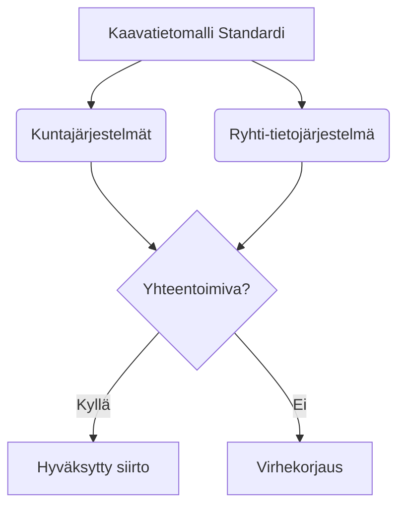

# Kaavatietomalli.fi

A serverless headless CMS website built with React, Vite, and Tailwind CSS. The platform serves as a modern landing page, blog, and documentation archive for Finland's unified spatial planning data model (*Kaavatietomalli*).

---

## Table of Contents
1. [Core CMS Operating Process](#core-cms-operating-process)
2. [Data Model Browser](#data-model-browser)
3. [Content Provider & Editorial Guide](#content-provider--editorial-guide)
   - [Structure of Content Directories](#1-structure-of-content-directories)
   - [Drafts vs. Scheduled Blog Posts](#2-drafts-vs-scheduled-blog-posts)
   - [Global Navigation & Theme Mapping](#3-global-navigation--theme-mapping)
   - [Content Contribution Workflow](#4-content-contribution-workflow)
   - [Advanced Rich Content Features](#5-advanced-rich-content-features)
   - [Testing & Validating Your Content](#6-testing--validating-your-content)
   - [Automated Nightly Publishing Pipeline](#7-automated-nightly-publishing-pipeline)
4. [Project & Code Architecture](#project--code-architecture)
   - [Directory Structure & Responsibilities](#1-directory-structure--responsibilities)
   - [Core Rendering Components](#2-core-rendering-components)
   - [Orama-Based Site Search](#3-orama-based-site-search)
5. [Testing Implementation & Developer Guidance](#testing-implementation--developer-guidance)
   - [Architectural Patterns & Component Isolation](#1-architectural-patterns--component-isolation)
   - [Unit & Integration Testing (Vitest + RTL)](#3-unit--integration-testing-vitest--rtl)
   - [End-to-End Testing (Playwright)](#5-end-to-end-testing-playwright)
   - [Test Content & Local-Test Variants](#6-test-content--local-test-variants)
   - [AWS CDK Stack & S3/CloudFront Deployment](#7-aws-cdk-stack--s3cloudfront-deployment)
6. [Contribution Guidelines](#contribution-guidelines)
7. [Development & Build Commands](#development--build-commands)

---

## Core CMS Operating Process

The platform operates as a **git-backed serverless developer CMS**. It requires zero database instances or complex backend runtimes. Instead, it relies on static file generation and indexing during the build phase to yield ultra-fast loads, robust offline capabilities, and maximum security.

```
       [ Markdown Content ] (.md files in /content)
                │
                ▼ (npm run prebuild)
   ┌─────────────────────────────────────────────────────────┐
   │  Ingestion scripts index content, generate metadata,     │
   │  compile search indices & fetch external Giscus stats.   │
   └─────────────────────────────────────────────────────────┘
                │
                ├────────────────────────┬────────────────────────┐
                ▼                        ▼                        ▼
     [ Static Asset Blobs ]     [ Search Index ]        [ Giscus Cache ]
     (public/content/*.json)   (public/search-index)    (public/giscus.json)
                │                        │                        │
                └────────────────────────┼────────────────────────┘
                                         ▼ (Deploy to static hosting / CDN)
                              ┌─────────────────────┐
                              │ Cloud Run CONTAINER │
                              └─────────────────────┘
                                         │
                                         ▼ (On-Demand Client Fetches)
                                  [ User Browser ]
                                (SPA React Engine)
```

1. **Markdown-Based Content Source**: Fully structured Markdown files in `/content` store blog posts, static pages, tags, and biographies.
2. **Build-Time Ingestion (`npm run prebuild`)**:
   - `scripts/generate-assets.ts`: Extracts frontmatter yaml configurations and body paragraphs into structured JSON assets within `/public/content/`.
   - `scripts/generate-search-index.ts`: Builds or registers a full-text client searchable schema into the Orama package.
   - `scripts/fetch-giscus-stats.ts`: Crawls discussions and retrieves comment indicators ahead of runtime presentation.
3. **Pre-Rendered On-Demand Access**: The React SPA parses and queries these local static files and compiled search databases sequentially on-demand using native lightweight HTTP `fetch` requests as users browse views.
4. **External API Content Synchronization (Suomi.fi)**: To showcase official data models and codelists, the platform downloads official specifications directly from the Finnish Interoperability Platform [Yhteentoimivuusalusta](https://dvv.fi/yhteentoimivuusalusta). These are fetched via external APIs, transformed and normalized into static JSON arrays, and stored locally within `/public/data/suomi.fi/`. This guarantees high performance and high availability, letting diagrams and codelists render instantly on the client without live API runtime dependencies.

---

## Data Model Browser

The website features an interactive **Data Model Browser** designed to make Finland's unified spatial planning data specifications (*Kaavatietomalli*) accessible, queryable, and understandable to planners, developers, and public authorities.

### Purpose and Core Functionality
Implemented by the `DataModelView` component, the Data Model Browser provides a rich, single-page application interface to navigate complex geographic data structures:
* **Interactive Class Diagrams**: Dynamically renders standard UML class diagrams of spatial planning entities using a responsive canvas powered by Mermaid.js. Clicking a class node isolates its local inheritance and association graph.
* **Property & Association Inspector**: Details all technical attributes, allowed data types, cardinality constraints (e.g., `0..1`, `1..*`), and conceptual definitions for the selected class.
* **Codelist Integration**: Interlinks class attributes directly with Finland's official reference codelists (*koodistot*), allowing users to browse valid enumerated values and classifications in place.
* **Deep Linking & State Synchronization**: Synchronizes active browser selections with URL query parameters (such as `?model=<model-id>&class=<class-name>` or `?model=<model-id>&codelist=<codelist-name>`), enabling precise sharing, referencing, and navigation throughout the documentation.
* **Tri-lingual Localization**: Seamlessly toggles metadata definitions, names, and comments between Finnish (`fi`), Swedish (`sv`), and English (`en`).

### Architecture of Local Translated Content
To eliminate expensive server-side databases and secure ultra-fast load times, the Data Model Browser operates purely on local, static JSON file copies:
* **Storage Location**: Pre-processed schema files are saved locally inside `/public/data/suomi.fi/tietomallit/` (for data models) and `/public/data/suomi.fi/koodistot/` (for reference codelists).
* **Multi-language Bundling**: The raw specifications are combined with their official translations from Suomi.fi during the pre-build phase, producing localized key-value structures. This ensures that the React application can switch languages instantly in the client’s browser without firing additional network requests to external APIs.

### Automated Synchronization with Suomi.fi
To ensure the website remains the single source of truth without manual editing, content is kept up-to-date automatically with the official registries on the **Suomi.fi Interoperability Platform** (*Yhteentoimivuusalusta*):

```
┌───────────────────────────────────────┐
│ Suomi.fi Interoperability API Portal  │
└───────────────────┬───────────────────┘
                    │
                    ▼ (npm run fetch-data via nightly GitHub Actions)
┌───────────────────────────────────────┐
│ Fetch RDF/JSON-LD Schemas & Codelists │
└───────────────────┬───────────────────┘
                    │
                    ▼ (Local Transform & Translate)
┌───────────────────────────────────────┐
│  Generate Normalized JSON flat files  │
└───────────────────┬───────────────────┘
                    │
                    ▼
┌───────────────────────────────────────┐
│      Pre-render and Build Site        │
└───────────────────────────────────────┘
```

1. **Extraction Scripts**: The developer tooling provides two dedicated node-based synchronization scripts:
   - `scripts/fetch-data-models.ts`: Downloads raw schemas via the Suomi.fi data model API (`getModelAsFile`), maps RDF properties, extracts attribute-level structures, and generates class diagram definitions.
   - `scripts/fetch-codelists.ts`: Queries the Suomi.fi code registry, extracts valid enumeration codes, names, and descriptions, and normalizes them into structured static arrays.
2. **Transform and Normalize**: The ingestion scripts parse official Suomi.fi REST payloads, translate empty fields using automated fallback rules, and map complex URI properties onto a clean, standardized JSON format.
3. **Continuous Nightly Sync**: As part of the nightly scheduled pipeline, the site runs the automated `npm run fetch-data` check. If any updates are detected on the Suomi.fi platform, the workflow automatically commits the updated JSON copies, builds the React bundle, and redeploys the site. This guarantees high availability and resilience—the browser never depends on a live external API connection to render specifications.

---

## Content Provider & Editorial Guide

This section is designed specifically for **Content Providers and Editors** who maintain the website's articles, pages, images, and navigation menus. You do not need deep software development skills to manage content, but a basic understanding of Markdown and Git/GitHub is assumed.

### 1. Structure of Content Directories

All website content is stored as flat files inside the `/content` directory in the repository:

* **Blog Posts (`/content/posts/`)**:
  - Individual articles written in Markdown (`.md`).
  - Organized directly in the folder or inside year-based subdirectories (e.g., `/content/posts/blog/2026/my-post.md`).
  - Each post must contain YAML frontmatter at the very top (fenced by `---` lines) to declare title, publication date, author slug, tags, and excerpt.
* **Static Pages (`/content/pages/`)**:
  - Main info pages of the website (e.g., laws & regulations, data models, about page).
  - Also in Markdown (`.md`) format with required YAML frontmatter (e.g., `title`).
* **Author Biographies (`/content/authors/`)**:
  - Short biographies for the authors of blog posts.
  - Linked to posts via the author's slug (the filename without `.md`, like `ilkka-rinne`).
* **Images (`/content/images/`)**:
  - Store post-specific illustrations, diagrams, SVGs, or custom graphics here. 
  - Accessible on the front-end using standard markdown image paths or absolute paths.

---

### 2. Drafts vs. Scheduled Blog Posts

To provide editorial flexibility, the platform offers built-in support for **Drafts** and **Scheduled Posts**:

#### A. Draft Posts & Pages
If you are working on a piece of content that is not ready for the public, add `draft: true` to the YAML frontmatter at the top of your Markdown file:
```yaml
---
title: "My Work-in-Progress Article"
date: "2026-07-24"
author: "ilkka-rinne"
excerpt: "A draft article under development."
tags: ["tietomallit"]
draft: true
---
```
* **Behavior**: The build system completely filters out and ignores any files marked with `draft: true`. They will not be compiled, indexed in search, or deployed to production.

#### B. Scheduled Posts
You can write posts in advance and schedule them to be published automatically at a specific date and time by setting the `publishDate` metadata property:
```yaml
---
title: "Announcing a Future Standard"
date: "2026-08-01"
author: "ilkka-rinne"
excerpt: "This post will be automatically visible to readers on August 1st."
tags: ["tietomallit"]
publishDate: "2026-08-01T00:00:00Z"
---
```
* **Behavior**:
  - **In-dev previews / Builds**: If `publishDate` is set in the future relative to the client's current date, the article is hidden from search and listings on the live site.
  - **Nightly publishing**: An automated workflow runs every night (see [Automated Nightly Publishing Pipeline](#7-automated-nightly-publishing-pipeline) below) to check if any scheduled post's `publishDate` has passed. When it does, the workflow automatically triggers a fresh deployment, making the post live on the site.

---

### 3. Global Navigation & Theme Mapping

The file `/content/content-config.json` acts as the website's central editorial dashboard. It lets you manage:
1. **The Navigation Menu (`nav`)**:
   - Order, labels, and links of items appearing in the header navigation menu.
   - Supports static pages, tag pages, external links, and dropdown submenus.
2. **Themes & Tags (`themes`)**:
   - Lists main tags (e.g. `lainsäädäntö`, `tietomallit`) and maps them to human-readable names and visual labels.

To modify the navigation or add a submenu, simply edit `/content/content-config.json` directly. No developer code modifications are needed.

---

### 4. Content Contribution Workflow

Content updates are managed via standard GitHub Issues and Pull Requests to maintain quality and prevent accidental typos or broken formatting from making it onto the live site:

1. **Start with an Issue**:
   - Open a GitHub Issue explaining what content is being added or updated (e.g. "Add blog post about July Ryhti updates").
2. **Create your Working Branch**:
   - Pull the latest changes from the master branch (`git checkout main` and `git pull`).
   - Create a content-specific branch: `git checkout -b content/july-ryhti-updates`.
3. **Draft your Content**:
   - Create or edit your Markdown files, add images, and update configs as needed.
4. **Locally Test your Content**:
   - Run the local content validator command (see [Testing & Validating Your Content](#5-testing--validating-your-content)) to check for errors before pushing.
5. **Push and Open a Pull Request (PR)**:
   - Push your branch to GitHub: `git push origin content/july-ryhti-updates`.
   - Open a Pull Request targeting the `main` branch. Link it to your original GitHub Issue.
6. **Automated Review & Approval**:
   - Continuous Integration (GitHub Actions) runs automated checks on your PR.
   - Another team member reviews the content.
   - Once approved and merged, the changes are automatically built and deployed to production.

---

### 5. Advanced Rich Content Features

To make the documentation and blog posts highly engaging, the platform provides first-class support for interactive and rich content elements. You can embed videos, render process/structural diagrams, and insert fully interactive spatial planning maps directly using standard Markdown code blocks.

#### A. Embedded Video Blocks (`youtube` & `vimeo`)
If you need to embed videos, use the custom ````youtube```` or ````vimeo```` code blocks. Do not use standard HTML iframe codes; the CMS renders these blocks securely and adaptively:

```markdown
```youtube
id: "dQw4w9WgXcQ"
title: "My custom video title"
aspectRatio: "16:9"
```


* **Supported properties**:
  - `id` (Required): The YouTube or Vimeo video identifier (e.g., `dQw4w9WgXcQ`).
  - `title` (Optional): Descriptive title for accessibility.
  - `aspectRatio` (Optional): Aspect ratio string (e.g., `"16:9"` or `"4:3"`, defaults to `"16:9"`).

---

#### B. Mermaid Diagrams (`mermaid`)
You can draft flowcharts, process models, sequence diagrams, and state machines in plain text. Any code block declared with ````mermaid```` is automatically rendered as an interactive vector SVG diagram:

```markdown



* **Supported diagram types**:
  - Flowcharts (`graph TD` or `graph LR`)
  - Sequence Diagrams (`sequenceDiagram`)
  - Class Diagrams (`classDiagram`)
  - State Diagrams (`stateDiagram-v2`)
  - Entity Relationship Diagrams (`erDiagram`)
  - GANTT Diagrams (`gantt`)
  - Pie Charts (`pie`)
  - Mind maps (`mindmap`)

* **Pro-tip**: Ensure text inside shapes is descriptive and concise.

---

#### C. Interactive Spatial Maps (`geojson` & `jsonfg`)
Because spatial planning data (*Kaavatietomalli*) is geographical, the website includes an interactive Leaflet map viewer. You can embed spatial geometries directly in your Markdown using either standard **GeoJSON** or **JSON-FG** (the modern OGC standard with improved Coordinate Reference System support):

##### GeoJSON Example:
```markdown
```geojson
{
  "type": "FeatureCollection",
  "features": [
    {
      "type": "Feature",
      "properties": {
        "nimi": "Keskusta-alueen yleiskaava",
        "tyyppi": "Yleiskaavamerkintä"
      },
      "geometry": {
        "type": "Polygon",
        "coordinates": [
          [
            [24.991, 60.165],
            [25.015, 60.165],
            [25.015, 60.155],
            [24.991, 60.155],
            [24.991, 60.165]
          ]
        ]
      }
    }
  ]
}
```

##### JSON-FG (OGC Features and Geometries JSON) Example:
```markdown
```jsonfg
{
  "type": "FeatureCollection",
  "conformsTo": [
    "http://www.opengis.net/spec/json-fg-1/0.2/conf/core"
  ],
  "features": [
    {
      "type": "Feature",
      "id": "asema-kaava-102",
      "place": {
        "type": "Polygon",
        "coordinates": [
          [
            [24.991, 60.165],
            [25.015, 60.165],
            [25.015, 60.155],
            [24.991, 60.155],
            [24.991, 60.165]
          ]
        ]
      },
      "properties": {
        "nimi": "Asemakaava-alue",
        "tila": "Hyväksytty"
      }
    }
  ]
}
```

* **Interactive Features on the Map**:
  - **Click to Inspect**: Click on any map marker, line, or polygon to open an informative popup detailing all attributes defined in the geometry's `"properties"` object.
  - **Expand to Fullscreen**: Toggle full-screen mode by clicking the expand button in the map header.
  - **Basemap Toggle**: Toggle between light and dark basemaps to highlight contrasting visual features.

---

#### D. Interactive Data Model Diagrams (`data-model-snippet`)
You can automatically generate visual, interactive Mermaid class diagrams directly from the downloaded Suomi.fi data models by using the custom ````data-model-snippet```` codeblock in your Markdown:

```markdown
```data-model-snippet
modelId: "rytj-kaava-1.0.5"
classes:
  - "Kaava"
  - "Kaava-asianPaatos"
lang: "fi"
```


* **Supported properties**:
  - `modelId` (Required): The identifier of the fetched data model (e.g., `rytj-kaava-1.0.5` or `https://iri.suomi.fi/model/rytj-kaava/#v1.0.5`).
  - `classes` (Required): An array of class names (written in standard YAML list format or a JSON-like array) to render. If specific classes are named, only those classes and their associated properties/relations are included in the generated diagram.
  - `lang` (Optional, defaults to `"fi"`): The language code to use for rendering human-readable names of the classes and attributes (e.g., `fi`, `sv`, `en`).

---

#### E. Interactive Instance Diagrams (`instance` / `mermaid-instance`)
You can quickly create styled object and instance diagrams representing actual structures of data with relationships using the custom ````instance```` or ````mermaid-instance```` codeblock:

```markdown
```instance
instanceDiagram
instance alice : User {
  id = 101
  role = "ADMIN"
}
instance ord1 : Order {
  total = "45.50"
}

alice -> ord1 : places
```

* **Features and Syntax Guidelines**:
  - **Optional Diagram Title**: You can declare a chart title at the top of the block using `title: Your Custom Title` or `title = Your Custom Title`. The title is transpiled into Mermaid's native, built-in YAML frontmatter config title blocks, rendering correctly inside the Mermaid graphic element itself.
  - **Start Marker**: Include `instanceDiagram` as the first line of the code content (or directly after an optional `title` line).
  - **Object/Instance Declarations**: Declare instances using `instance name : ClassName { ... }` or `object name : ClassName { ... }` with inner `key = value` attributes. Supports Scandinavian characters and custom attribute type formatting.
  - **Relationships**:
    - Directed links: `alice -> ord1 : label` (transpiles to standard Arrow connections).
    - Bidirectional links with dual roles: `alice <-> acc99 : owner | account` (displays a double-ended arrow decorated with distinct left and right role text).
    - Undirected links with dual roles: `alice --- acc99 : owner | account` (displays a connection line decorated with role descriptions).

---

#### F. Semantic Callout Blocks (Admonitions)
You can highlight key points, guidelines, warnings, or tips using stylized callout blockquotes. These blocks feature distinct background colors, thick left accent borders, and matching vector icons.

##### Supported Types
The CMS supports four primary callout types:
* **Note** (renders with a Blue theme and a dynamic localized header, *Huomautus*)
* **Warning** (renders with a Red theme and a dynamic localized header, *Varoitus*)
* **Tip** (renders with an Emerald theme and a dynamic localized header, *Tärkeää*)
* **Info** (renders with a Cyan theme and a dynamic localized header, *Huomaa*)

##### Syntax
Use the standard blockquote marker `>` followed by the tag indicator inside brackets. An optional exclamation mark (e.g., `[!NOTE]`) is supported:

```markdown
> [!NOTE]
> Tämä on tärkeä huomautus lukijalle.
```

##### Custom Callout Titles
You can override the default localized title with a custom, user-provided title text by adding a double colon (`::`) separator after the type name:

```markdown
> [Note::Historiallinen huomio]
> Kehityksen alkuvaiheessa arveltiin, että tämän tasoinen tuki on riittävä.
```

The rendering engine automatically extracts the custom title, strips the annotation from the body text, and keeps the styling matches perfectly.

---

#### G. Interactive Images (`interactive-image`)
To integrate highly detailed schemas, UML diagrams, or system architectures saved as SVG graphics, use the custom ````interactive-image```` code block. This embeds the graphic as a fully interactive image with zoom-and-pan capabilities (including mouse dragging, pinch-to-zoom gestures, mouse wheel adjustments, and touch support), rendering in a sleek, darkened context with double-click and full-screen preview triggers.

##### Syntax (YAML-style):
```markdown
```interactive-image
href: "/content/images/data-hierarchy.svg"
title: "Tietorakenne ja luokkahierarkia"
alt: "Kaavatietomallin looginen UML-rakennekaavio"
note: "© 2026 Suomen ympäristökeskus"
style: "background-color: #f8fafc; border-radius: 8px;"
```
```

##### Alternative Syntax (JSON-style):
```markdown
```interactive-image
{
  "href": "/content/images/data-hierarchy.svg",
  "title": "Tietorakenne ja luokkahierarkia",
  "alt": "Kaavatietomallin looginen UML-rakennekaavio",
  "note": "© 2026 Suomen ympäristökeskus",
  "style": "background-color: #f8fafc; border-radius: 8px;"
}
```
```

* **Supported properties**:
  - `href` (Optional if `svgContent` is provided): The relative or absolute URL path referencing the source `.svg` file to fetch and render.
  - `svgContent` (Optional if `href` is provided): Directly embedded raw SVG source code. This enables offline-first vector diagram rendering without requesting external network resources.
  - `title` (Optional): A readable, descriptive header string positioned above the image.
  - `alt` (Optional): Alternate text description used for accessible rendering and screen readers.
  - `note` (Optional): Short note text (such as a copyright notice or citation) displayed as a small italic caption under the inline image and as a beautiful floating overlay inside the full-screen modal viewport.
  - `style` (Optional): Custom, inline-style rule declarations. Properties specified here are parsed into a dynamic React style dictionary and merged directly with the inline style properties of the immediate SVG container elements, completely eliminating clipping issues and HTML style tag injection.

---

### 6. Testing & Validating Your Content

To prevent common errors (such as missing required metadata fields or broken embedded video parameters) from breaking the website, you can run an automated validator locally:

* **Run Content Validator**:
  ```bash
  npm run test:content
  ```
  This command parses all files in `/content` and asserts that:
  - Every post has a valid title, date (or Date object), author slug, tags array, and non-empty excerpt.
  - All embedded video blocks (YouTube/Vimeo) match strict syntactic formats.

The content validation suite checks that the `id` is present, valid, and that all configuration parameters are correctly formed.

---

### 7. Automated Nightly Publishing Pipeline

The website incorporates a fully automated **Nightly Scheduled Rebuild & Deploy** GitHub workflow (`scheduled-build-deploy.yml`):

* **When it runs**: Every night at midnight UTC (`0 0 * * *`) and on-demand via GitHub's manual launch interface.
* **What it does**:
  1. It fetches the currently live blog articles list (`posts.json`) from the deployed website.
  2. It scans all Markdown files in the `/content/posts` folder in the repository.
  3. It identifies if there are any scheduled posts whose `publishDate` is now in the past but are not yet live in the deployed list.
  4. It fetches and compares comment activity statistics from external Giscus discussions to check if indicators/counters need updating.
  5. **Smart Rebuild Logic**: If new scheduled posts are ready to be published, or if Giscus stats have updated, it automatically launches a build, runs all test suites, and deploys the new version of the site. If no publishable content changes are detected, it exits early to save build resources.

---

## Project & Code Architecture

To ensure the codebase remains maintainable, modular, and easy to extend as the website evolves, it is organized into distinct directories with clear, decoupled responsibilities.

### 1. Directory Structure & Responsibilities

* **`src/components/`**: 
  - Houses all UI components, views, layouts, and interactive visual blocks. 
  - Sub-components are extracted into modular files to prevent monolithic code structures and stay within optimal compiler limits.
* **`src/hooks/`**:
  - Implements custom React hooks that isolate business logic, search engines, and lifecycle state management from visual layout components.
* **`src/i18n/`**:
  - Manages translation dictionaries (e.g., Finnish translation file `fi.ts`) and provides centralized localization helpers (`index.ts`). This isolates text assets to support painless language expansions and ensure localization-invariant unit/E2E testing.
* **`src/lib/`**:
  - Contains core utility libraries, markdown parsing drivers, sitemap and RSS structures, and the main data-fetching interface (`blog.ts`) that maps JSON assets onto strongly-typed TypeScript objects.
* **`src/services/`**:
  - Operates background workflows and third-party script management, including GDPR-compliant analytics tracking, Google Tag Manager initialization, and persistent client settings.
* **`src/test/`**:
  - Configures centralized testing infrastructure (e.g., `setup.ts` to manage Happy DOM environments, mock global objects like `IntersectionObserver`, and register Vitest matches).

---

### 2. Core Rendering Components

While many secondary helper components exist in `/src/components/` to handle visual layouts (e.g., footer logos or table-of-contents elements), the core page routing and content-rendering lifecycle is driven by the following key components:

* **`HomeView`**:
  - Serves as the primary landing page of the application. It establishes the main hero section, renders the chief editor's profile badge (linking to their biography), provides theme tag category filters, and orchestrates the inclusion of chronological views by nesting `HistoryHero` and `Timeline`.
* **`Navigation`**:
  - Renders the global header, footer, and navigation layouts. It reads navigation elements dynamically from `/content/content-config.json` to assemble responsive menus, sub-navigation dropdowns, language selectors, and accessible mobile navigation drawers.
* **`PostView`**:
  - Orchestrates individual blog post or historical articles. It dynamically fetches the author's avatar to render a small details card linking to their full biography page. It parses Markdown content, provides a sticky Table of Contents, loads embedded custom blocks (videos, maps, diagrams), sets up Giscus comments, and renders promotional CTA panels with built-in conversion tracking.
* **`PageView`**:
  - Renders static informational content pages (e.g., legislation, data models, or standard specifications). It converts page Markdown into stylized typographic grids and supports embedded Table of Contents navigation.
* **`DataModelView`**:
  - Renders the interactive Data Model Browser, enabling users to explore Finland's spatial planning data standards. It manages sidebar selectors for classes and reference codelists, constructs dynamic Mermaid class diagrams, displays detailed attribute and association tables in inspector panels, and synchronizes browser selections with URL query parameters for precise sharing and deep linking.
* **`AuthorView`**:
  - Serves as the dedicated profile page for individual content contributors. It loads author-specific biographical Markdown, displays their professional contact coordinates (LinkedIn, Github, website, obfuscated email), highlights their list of specialties, and displays interactive custom Spatineo cooperation CTA sections.
* **`TagView`**:
  - Aggregate view that displays lists of posts categorized under a specific theme/tag. It translates the tag ID into its corresponding human-readable title via the central content config and renders matching posts in chronological order.
* **`Timeline`**:
  - Displays blog and news updates (posts in the `'journal'` category) in a beautiful, vertical, chronological feed. It features support for lazy-loaded infinite scroll pagination and dynamic tag filtering.
* **`HistoryHero`**:
  - A highly visual, horizontal scrolling interactive timeline showcasing chronological spatial planning standard milestones and historical landmarks (posts in the `'history'` category) with distinct visual nodes.
* **`ErrorBoundary`**:
  - A robust safety boundary wrapping core viewport grids to gracefully capture and handle runtime compilation or rendering errors (e.g., from faulty Markdown formatting), showing user-friendly recovery options rather than crashing the site.
* **`SearchBox`**:
  - The modal interface overlay for full-text search. It connects directly to the in-memory client-side Orama index to display immediate, keyboard-navigable suggestions and structured results.

---

### 3. Orama-Based Site Search

The website implements a robust, client-side, full-text search capability powered by **Orama**, a lightning-fast, dependency-free search engine. This enables instantaneous results across articles, static documentation pages, data model entities, and reference codelists, without relying on external search APIs.

#### A. Tri-Lingual Search Indexing
Search indices are pre-compiled during the static build phase via `scripts/generate-search-index.ts`. This script builds three independent, language-specific Orama databases (`search-index-fi.json`, `search-index-sv.json`, and `search-index-en.json`):
1. **Markdown Content**: Scans, parses, and extracts text content from all Markdown documents inside `/content/posts`, `/content/pages`, and `/content/authors`, mapping frontmatter metadata into standard schema properties.
2. **Data Model Classes**: Iterates through local normalized JSON schemas inside `/public/data/suomi.fi/tietomallit/`. It indexes each class under `type: 'class'`, mapping class technical names, Finnish/Swedish/English localized labels, class descriptions, and structured string listings of attribute names for deeper matching.
3. **Reference Codelists**: Iterates through local reference codelist JSON copies under `/public/data/suomi.fi/koodistot/`, mapping codelist technical keys, localized definitions, descriptions, and concatenated lists of allowed enumeration codes and codes' localized names under `type: 'codelist'`.
4. **Natural Language Stemming**: Each language-specific index uses specialized tokenizer stemming components (`fiStemmer` for Finnish, `svStemmer` for Swedish, `enStemmer` for English) to normalize search query inputs and indexed terms, maximizing fuzzy matching accuracy.

#### B. Querying and Result Merging
The client-side search logic is orchestrated by the `useOramaSearch` hook (`src/hooks/useOramaSearch.ts`):
1. **Index Hydration**: Automatically loads and initializes the three language-specific search indices on application boot, with built-in versioning query params (`?v=${BUILD_VERSION}`) to invalidate outdated client-side cache layers.
2. **Dynamic Query Weighting & Boosting**: Configures query fields with custom boost factors to prioritize highly-relevant fields over deep body text:
   - `title`: Boost factor of `2.0` (highest weight)
   - `name`: Boost factor of `2.0`
   - `company`: Boost factor of `1.5`
   - `tags`: Boost factor of `1.5`
   - `content` / `excerpt`: Normal weight (`1.0`)
3. **Multi-Index Querying**: Executes search queries across all three language databases concurrently.
4. **Result Merging**: Merges hits from the parallel queries into a single unified result list. The results from the language-specific are merged into a combined ranking using the max score method.

#### C. Unified UI Integration
The search service is consumed by three primary user-facing components to provide uniform navigation and instant search capabilities across the app:
1. **`SearchWidget`**: Renders the global, persistent header search button. Clicking it activates a backdrop overlay and mounts the full-screen `SearchBox` modal. It triggers debounced search operations as the user types, displaying categorized and highlighted lists of matching documents.
2. **`NotFoundView`**: The dedicated 404 error page. It parses the broken slug, populates an inline `SearchBox` with the closest natural language equivalent, and invites the user to run instant queries over the data models and publications to find their target destination.
3. **`DataModelView`**: The class and codelist search within the selected data model is powered by the Orama indexes, with filtering to provide only hits related to the selected data model. The App also supports deep linking of class search results. When users click on a search result of type `class` or `codelist` in the generic site search, the search navigation resolves it directly, deep-linking them to the relevant data model and focusing on the class or codelist within the inspector sidebars.
4. **Centralized Routing**: All search interactions feed into a single, unified `handleSearchNavigate` routing method in `src/App.tsx`. This avoids scattered routing logic by handling all search result redirects—including post navigation, page transitions, and deep linking into specific classes or codelists within the `DataModelView` browser—in a single place.

---

## Testing Implementation & Developer Guidance

This codebase is specifically engineered to support flawless, isolation-friendly testing via **Vitest + React Testing Library (RTL)** for localized hooks/views, and **Playwright** for deep automated integration flows.

### 1. Architectural Patterns & Component Isolation

To prevent test flakiness and high memory usage, the codebase enforces strict boundaries around rich client components. 

* **Why?**: Graphical rendering nodes like Leaflet Maps (which depend on container coordinate offsets and layout sizes) and Mermaid rendering workflows (which construct complex layouts in WebAssembly or browser SVG spaces) will crash inside standard virtual Node DOM runtimes like `jsdom` or `happy-dom`.
* **Testing Guidelines**:
  - Always verify fallback paths. Both `GeoJSONMapViewer` and `Mermaid` are designed to detect environmental execution failures or library loading errors, rendering accessible fallback test markers:
    ```html
    <!-- Rendered if Leaflet fails to mount inside node/happy-dom tests -->
    <div data-testid="geojson-map-viewer-fallback">...</div>

    <!-- Rendered if Mermaid rendering engine encounters an issue -->
    <div data-testid="mermaid-fallback">...</div>
    ```
  - When writing RTL tests for visual nodes, mock out Leaflet and Mermaid libraries completely, and assert on the appearance of their test identifiers rather than pixel computations.

---

### 2. Best Practices & Key Implementation Decisions

Based on rigorous testing of our custom hooks and components, developers **must** adhere to the following conventions:

#### A. Co-location of Test Files
Always store test files in the **same directory** as the file being tested (e.g. `src/hooks/useOramaSearch.test.tsx` directly adjacent to `src/hooks/useOramaSearch.ts`). This enhances maintainability, simplifies import graphs, and allows test runners to quickly isolate components.

#### B. ESM Mocking & Hoisting workarounds
When mocking ES Modules or databases like `@orama/orama` inside Vitest, mock factories are hoisted to the top level. Ensure your mock handlers are fully self-contained (i.e. returning hardcoded mock datasets or self-contained `vi.fn()` configurations inside the mock declaration) to avoid reference errors regarding variables defined out-of-scope.

#### C. Temporal State Validation
When assertions depend on system time comparison (e.g. Orama filtering out scheduled blog posts that lie in the future relative to the current local date), use Vitest’s fake timer utilities:
```typescript
beforeEach(() => {
  vi.useFakeTimers();
  vi.setSystemTime(new Date('2026-05-29T12:00:00Z'));
});

afterEach(() => {
  vi.useRealTimers();
});
```

#### D. Bypassing Motion Animation Loops
Components utilizing `@motion` or `motion/react` can cause RTL test suites to hang or hit timeouts because of asynchronous animation loop ticks or missing browser layout cycles. Mock out animation elements to return plain, clean React markup:
```typescript
vi.mock('motion/react', () => ({
  motion: {
    div: ({ children, ...props }: any) => {
      const { transition, animate, initial, exit, ...rest } = props;
      return <div {...rest}>{children}</div>;
    },
  },
  AnimatePresence: ({ children }: any) => <>{children}</>,
}));
```

#### E. Silencing Expected Console Error Logs
Testing dynamic library failures or query rejection pipelines inevitably triggers standard `console.error` outputs in Jest/Vitest logs. To ensure clean, green CI logs, spy on and suppress expected logging noise:
```typescript
let consoleErrorSpy: any;
beforeEach(() => {
  consoleErrorSpy = vi.spyOn(console, 'error').mockImplementation(() => {});
});
afterEach(() => {
  consoleErrorSpy.mockRestore();
});
```

#### F. Multi-lingual & Localization-Invariant Testing (Anti-Fragile Keys)
Avoid hardcoding Finnish or English texts (e.g., `screen.getByText(/virhe/i)` or `.getByRole('button', { name: /Koodi/i })`) directly in UI test suites. Instead, import the dynamic localization helper `getTranslations()` (or the translation dictionary `fi` directly) in the test and match against dynamic values:
```typescript
import { getTranslations } from '../i18n';
const t = getTranslations();

it('uses translation keys for matching', () => {
  render(<GeoJsonMapViewer code="invalid" />);
  expect(screen.getByText(new RegExp(t.geojson.jsonParseError, 'i'))).toBeDefined();
});
```
This guarantees that UI and custom rendering tests remain fully robust against future language translations, copy updates, or localization changes.

#### G. Intercepting Head Script Appending for Dynamic Scripts (Analytics & GTM)
When testing scripts that dynamically inject files (such as injecting Google Tag Manager or YouTube elements) into `document.head`, virtual light DOM environments like `happy-dom` will yell with `DOMException [NotSupportedError]: JavaScript file loading is disabled` causing test list clutter.
To circumvent this, install global spies on `document.head.appendChild` and `document.head.querySelector` in your unit tests (like `consent-analytics.test.ts`) to intercept element injects and redirect matching calls into a lightweight mock array:
```typescript
const injectedScripts: HTMLScriptElement[] = [];
vi.spyOn(document.head, 'appendChild').mockImplementation((node) => {
  if (node instanceof HTMLScriptElement) {
    injectedScripts.push(node);
  }
  return node;
});
```

#### H. End-to-End Test Localization Resilience via i18n Dictionary Access
Just like unit tests, Playwright end-to-end tests must avoid hardcoded string values for matching buttons, labels, and togglers (e.g. `locator('button:has-text("Lue lisää")')`). Import the underlying static translation directory (e.g., `import { fi } from '../src/i18n/fi'`) and utilize standard interpolation to look up matching indicators securely:
```typescript
import { fi } from '../src/i18n/fi';
const t = fi;

test('asserts button exist robustly', async ({ page }) => {
  const readMoreBtn = page.locator(`button:has-text("${t.post.readMore}")`).first();
  await expect(readMoreBtn).toBeVisible();
});
```
This enables the E2E test scripts to survive sweeping copy alterations or site-wide tone-of-voice migrations without single-line logic refactoring.

---

### 3. Unit & Integration Testing (Vitest + RTL)

#### A. Testing the decoupling utility hook: `useContentLoader`
The state machine is contained cleanly inside a custom hook, letting you test routing and data fetch orchestration without loading massive UI components.

* **Target File**: `src/hooks/useContentLoader.ts`
* **Test File**: `src/hooks/useContentLoader.test.tsx`
* **Test Strategy**:
  1. Mock out the core data operations within `src/lib/blog.ts` (`getPostBySlug`, `getPageBySlug`, etc.).
  2. Use `@testing-library/react`'s `renderHook` helper to feed varying `activeView` inputs.
  3. Validate that `isDataReady` resolves to `true` relative to correct actions, and verify that trailing visual states are cleared between distinct layout transitions.

```typescript
// Example Vitest test snippet for useContentLoader
import { renderHook, waitFor } from '@testing-library/react';
import { useContentLoader } from './useContentLoader';
import * as blogLib from '../lib/blog';

vi.mock('../lib/blog', () => ({
  getPostBySlug: vi.fn(),
  getPostsByTag: vi.fn(),
  getTagPageSlugs: vi.fn(),
}));

describe('useContentLoader', () => {
  it('identifies ready state only when slug content returns fully loaded', async () => {
    const mockPost = { slug: 'test-post', title: 'Test Post', content: '# Hello' };
    vi.mocked(blogLib.getPostBySlug).mockResolvedValue(mockPost as any);

    const { result } = renderHook(
      ({ activeView }) => useContentLoader({ activeView, posts: [] }),
      { initialProps: { activeView: { type: 'post', slug: 'test-post' } } }
    );

    expect(result.current.isDataReady).toBe(false);

    await waitFor(() => {
      expect(result.current.isDataReady).toBe(true);
    });

    expect(result.current.currentPost).toEqual(mockPost);
  });
});
```

#### B. Testing Analytics Assertions via Event Spies
You can easily assert that view loads track page views, CTA selections, or author lookups without needing complex analytics library instrumentation.
* **Mechanism**: Every analytic method internally proxies details onto the global `window._trackedEvents` trace array.
* **Unit Verification**:
  ```typescript
  it('fires tracking event when navigating to static contents', () => {
    // Navigate or trigger interaction...
    expect(window._trackedEvents).toContainEqual(
      expect.objectContaining({ event: 'cta_click', data: expect.any(Object) })
    );
  });
  ```

---

### 4. Continuous Integration (GitHub Actions)

The test suite and deployment pipelines are fully wired into our software development lifecycle via distinct workflows under `.github/workflows/`:

- **Main CI/CD Pipeline (`build-deploy.yml`)**:
  - Automatically runs unit, integration, and hook tests via `npm run test:run` on pull requests targeting the `main` branch, ensuring all checks pass before integration. Direct pushing to `main` is strictly forbidden by branch protection rules.
  - Automatically builds and deploys the site on every pull request merged to `main`.
  - End-to-End browser tests are executed in actual headless profiles with `npm run test:e2e`. Playwright browsers are dynamically installed during the CI flow with `npx playwright install --with-deps`, and testing reports are uploaded as GitHub build artifacts under `playwright-report` with a 30-day retention window.

- **Scheduled Rebuild & Deploy (`scheduled-build-deploy.yml`)**:
  - Runs nightly via a schedule cron (`0 0 * * *`) and on-demand via `workflow_dispatch`.
  - **Rebuild Decision Engine & Resilient Skip Logic**: Invokes a specialized checker script (`scripts/check-scheduled-posts.ts`) to decide if a redeployment is necessary. It compares local markdown dates against currently deployed assets, triggering a full rebuild and deploy only if a scheduled post's publish date has passed or Giscus statistics have updated. For a detailed user-facing overview of this mechanism, see the [Automated Nightly Publishing Pipeline](#7-automated-nightly-publishing-pipeline) section.

---

### 5. End-to-End Testing (Playwright)

Playwright tests run in actual Chromium/WebKit environments to assert layout correctness, responsive adaptations, and raw routing triggers.

**Note**: All test configurations are completely self-contained. The `npm run test`, `npm run test:run`, and `npm run test:e2e` commands automatically trigger the `npm run prepare:test` setup pipeline which cleans the environments and prebuilds all test assets cleanly into the isolated `test-public` directory, so you do not need to run separate preparation commands manually beforehand.

#### A. Running E2E Tests & DevContainer Environment Setup
- **Local Execution**: To execute the E2E tests, make sure you run the self-contained command:
  ```bash
  npm run test:e2e
  ```
- **DevContainer / Docker Environment Troubleshooting**:
  If running the tests inside your VS Code DevContainer or a Docker-based virtual terminal and encountering missing browser modules or missing dynamic library binaries (e.g. `chrome-linux/headless_shell` or `libnspr4`), run the following sequences:
  ```bash
  # Step 1: Install Chrome/Webkit system dependencies
  sudo npx playwright install-deps
  
  # Step 2: Install browser binaries
  npx playwright install
  
  # Step 3: Run the end-to-end tests
  npm run test:e2e
  ```
  Our DevContainer's configuration is fully optimized to automate this sequence during its container spin-up process.

#### B. Target Selectors for E2E Tests
To ensure selectors remain durable when CSS layouts change, use the pre-built declarative test hooks:
- `data-testid="app-layout"`: Track layout lifecycle states.
  - Features dynamic properties that can be verified immediately:
    ```html
    <div 
      data-testid="app-layout"
      data-view-type="post"
      data-view-slug="digital-twins"
      data-is-ready="true" 
    />
    ```
- `data-testid="home-view"`: Confirms user successfully loaded home contents.
- `data-testid="post-view"`, `data-testid="page-view"`, `data-testid="tag-view"`: Standard wrappers matching different layouts.
- `data-testid="header"`, `data-testid="footer"`: Static navigation areas.
- `data-testid="search-input"`, `data-testid="search-results-container"`: Search utility interfaces.

#### C. Key Flow Assertions to Implement:
1. **The Navigation Flow**:
   - Verify that clicking blog posts in the feed updates the browser link, sets `data-view-type="post"`, and focuses appropriate scroll areas.
2. **Search Verification & Highlighting**:
   - Navigate to any view containing search containers (e.g. Navigation search or NotFoundView's search).
   - Enter query parameters (e.g., `"Malli"`) in `data-testid="search-input"`.
   - Assert `data-testid="search-results-container"` mounts visible choices.
   - Assert that hovering over an explicit search result correctly changes its individual style (highlighting only the current target element).
3. **Language Switch Execution**:
   - Locate translation links, click languages, and assert that dynamic translation strings resolve correctly without breaking current path states.

#### D. Critical E2E Test Resiliency & Pitfalls (Lessons Learned)
When writing, executing, and updating E2E tests, mind the following behaviors critical to our site structure:

1. **Avoid Overly Broad Text Selectors to Prevent Strict-Mode Violations**
   - *The Problem*: Locators like `page.locator('button:has-text("Muokkaa asetuksia")')` can match multiple elements. For instance, the floating settings bar at the bottom and the customize action inside the opened Cookie Consent Banner both utilize this label. Standard Playwright `.click()` operations will trigger a "strict mode violation: locator resolved to 2 elements" error.
   - *The Solution*: Scope the locator inside a parent component or use explicit unique identifiers:
     ```typescript
     // ✅ Always scope or target specifically:
     const bannerBtn = page.locator('[data-testid="cookie-consent-banner"]').locator('button:has-text("Muokkaa asetuksia")');
     ```

2. **Prefer Custom `data-testid` Over Ambiguous Element Traversal**
   - *The Problem*: Relying on relative position querying (like `div:has-text("Analytiikka-evästeet") >> button`) can incorrectly match unrelated higher-level navigation blocks (such as branding titles) if the translation keys are reuse-heavy.
   - *The Solution*: Explicitly declare custom test selectors (such as `data-testid="analytics-consent-toggle"`) directly on target interactable nodes to maintain an decoupled, bulletproof test surface.

3. **Handle Intercepting & Scroll State Preservation on Mobile Layouts**
   - *The Problem*: Standard Playwright `.click()` triggers an automatic scroll-into-view behavior before executing the target action. In mobile viewport assertions (such as checking if the scroll position is maintained when opening the navigation drawer), standard click operations can inadvertently reset or scroll the container/body offset to `0`.
   - *The Solution*: Utilize raw DOM dispatching `dispatchEvent('click')` to simulate viewport-independent user interactions without disrupting scroll position assertions:
     ```typescript
     // ✅ Bypasses auto-scroll behaviors in E2E assertions
     await menuButton.dispatchEvent('click');
     ```

---

### 6. Sandboxed Test Data & Test Content Directory Structures

To support comprehensive tests while completely protecting production data and content folders, the testing harness enforces strict **directory isolation** using sandboxed folders. This ensures that mock files are processed, compiled, and served without ever touching or modifying your production CMS `public/` assets.

#### A. Directory Architecture for Testing

The project uses three dedicated testing directories alongside the stable `/test-content/` folder:

1. **`/test-content/` (CMS Markdown Sandbox)**:
   - Contains a stable, predictable, and unchanging set of mock pages, blog posts, and author biographies.
   - When running in `CONTENT_MODE=test`, the static asset engines compile indexes and post pages using `/test-content/` instead of `/content/`.

2. **`/test-data/` (Data Specifications Sandbox)**:
   - Holds static, local mock source files used to simulate Suomi.fi data model schemas and reference codelists.
   - Includes:
     - `/test-data/model/`: Mock JSON-LD schema files (e.g., `rytj-kaava-v1.0.5.jsonld`) representing test data models.
     - `/test-data/codelist/`: Mock JSON codelist registry trees containing categories, metadata, and allowed enumeration codes.

3. **`/test-data-index/` (Registry Mapping Sandbox)**:
   - Contains sandboxed mapping directories mirroring the structure of `/data-index/` (e.g., `/test-data-index/suomi.fi/tietomallit/index.json` and `/test-data-index/suomi.fi/koodistot/index.json`).
   - Declares exactly which mock source files in `/test-data/` should be resolved, processed, and transformed under test mode.

4. **`/test-public/` (Vite Environment Isolation)**:
   - **Crucial Separation Rule**: When `CONTENT_MODE=test`, our Vite configuration dynamically overrides Vite’s standard `publicDir` option from `'public'` to `'test-public'`.
   - All generated mock JSON files, sitemaps, RSS feeds, and full-text search indexes are outputted inside `/test-public/` during `prepare:test`.
   - The test server then mounts `/test-public` as its root. This isolates the runtime completely, guaranteeing that production indexes and images in `/public` are never overwritten or affected during test execution.

#### B. Guidance on Adding New Test Data

If you need to introduce new test data models or codelist values for unit or integration assertions, follow these steps:

##### 1. Adding a Mock Data Model
1. Place your mock data model's raw JSON-LD schema inside `/test-data/model/` (e.g., `/test-data/model/my-mock-model-v1.0.0.jsonld`).
2. Register your new model version inside `/test-data-index/suomi.fi/tietomallit/index.json`. Add a model entry pointing to the local file:
   ```json
   {
     "id": "my-mock-model",
     "versions": ["1.0.0"]
   }
   ```

##### 2. Adding a Mock Codelist
1. Create a structured folder for your codelist category inside `/test-data/codelist/coderegistries/<registry>/codeschemes/<codelist-id>/`.
2. Place the codelist metadata file as `index.json` inside that folder, and place its enumerated codes inside a `codes/index.json` subfolder.
3. Register your new codelist inside `/test-data-index/suomi.fi/koodistot/index.json` under the appropriate registry section.

##### 3. Processing and Verifying
Simply run:
```bash
npm run test:run
```
This automatically triggers the self-contained `prepare:test` workflow, which will:
1. Clean previous compiled outputs under `test-public/`.
2. Extract, transform, and normalize your new local mock files from `/test-data/` into `/test-public/data/`.
3. Recompile the test full-text search indices (`test-public/search-index-*.json`) to include your new mock classes or codes.
4. Run all unit and integration test assertions.

#### C. Running and Developing Tests

We provide fully integrated commands in `package.json` that handle execution cleanly without manual folder setup:

* **Interactive Development Testing**:
  ```bash
  npm run test
  ```
  Launches Vitest in interactive watch mode. This command automatically builds test assets on-demand and serves the sandbox environment safely, preserving your normal local developer experience.

* **Single-Pass CI Testing**:
  ```bash
  npm run test:run
  ```
  Performs a complete clean, data transformation, and test run in a single pass. Ideal for pull-requests and verification checks.

* **E2E Integration Testing**:
  ```bash
  npm run test:e2e
  ```
  Prebuilds the isolated test environment and boots the Playwright test runner cleanly in a single, self-contained pipeline.

---

### 7. AWS CDK Stack & S3/CloudFront Deployment

The platform's cloud deployment architecture is fully defined as Infrastructure-as-Code (IaC) using the **AWS Cloud Development Kit (CDK)** in TypeScript. The infrastructure is designed to run on a highly secure, serverless, and production-ready static hosting structure powered by **Amazon S3** and **Amazon CloudFront**.

The CDK configurations are organized across:
* `/bin/app.ts`: Application entry point orchestrating the multi-stack setup.
* `/cdk/certificate-stack.ts`: Handles DNS hosting and regional SSL/TLS certificates.
* `/cdk/website-stack.ts`: Provisions S3 buckets, CloudFront CDN, IAM deployment roles, and Athena analytics.
* `cdk.json` & `tsconfig.cdk.json`: CDK CLI configuration and compiler settings.

#### A. Multi-Stack Architectural Design

To support custom domain names on a global content delivery network (CDN) while observing AWS's regional policies, the infrastructure is split into two distinct, coupled stacks:

1. **Certificate Stack (`KaavatietomalliWebsiteCertStack`)**:
   - **Region Constraint**: Deployed in `us-east-1` (US East - N. Virginia). Amazon CloudFront requires custom domain SSL/TLS certificates to reside exclusively in `us-east-1`.
   - **Route 53 Public Hosted Zone**: Automatically creates the public hosted zone for `kaavatietomalli.fi` within the project's AWS account.
   - **SSL/TLS ACM Certificate**: Requests a fully validated public certificate for the domain. Validation is performed automatically via DNS validation records added directly within the same hosted zone.
   - **Automated Domain Name Server (NS) Registry Sync**: Features a Lambda-backed custom resource (`UpdateDomainNameServers`) that calls the Route 53 Registrar API to automatically update the registered domain's nameservers at the registry level to match the newly generated hosted zone nameservers, eliminating manual registrar updating.

2. **Website Stack (`KaavatietomalliWebsiteMainStack`)**:
   - **Region**: Deployed in the project's primary default region (e.g., `eu-north-1`).
   - **Cross-Region References**: Leverages CDK cross-region referencing to automatically pass the validated ACM certificate ARN and public hosted zone object from the certificate stack in `us-east-1` down to the website distribution stack in the primary region.
   - **Dependency Chain**: The website stack maintains an explicit stack dependency on the certificate stack, ensuring certificates and DNS profiles are fully registered and validated before content distribution mechanisms are built.

#### B. Core Website Hosting Components

The website distribution stack provisions the following standard components:

1. **CloudFront S3 Access Logs Bucket**:
   - A private, secure S3 bucket for storing raw CDN delivery logs.
   - **Object Ownership (`BUCKET_OWNER_PREFERRED`)**: This is a modern, highly secure S3 configuration. Standard CloudFront log delivery requires the use of S3 Access Control Lists (ACLs). Configuring the bucket with `BUCKET_OWNER_PREFERRED` ensures that the website owner account automatically retains full ownership of all logs written by the CloudFront service, facilitating seamless log parsing without legacy ACL ownership conflicts.
   - **Retention & Cost Controls**: Implements a 365-day lifecycle policy. Raw logs automatically transition to Glacier storage after 30 days and are deleted after 365 days to prevent runaway storage fees.
2. **Private Website Content Bucket**:
   - A private S3 bucket hosting compiled React static files.
   - Strict `BlockPublicAccess.BLOCK_ALL` and default `S3_MANAGED` encryption are enforced. Public users cannot access website objects via raw S3 endpoint URLs.
3. **CloudFront CDN Distribution**:
   - Acts as the single, high-performance edge entry point for all website traffic.
   - **Origin Access Control (OAC)**: Enforces authenticated, secure handshakes between CloudFront and S3, ensuring S3 objects are only served through authorized CDN requests.
   - **Single-Page Application (SPA) Routing**: SPA-friendly error behaviors intercept standard `404` and `403` HTTP status codes, rewriting them to a `200` success response targeting `/index.html` with a custom `0` second TTL. This passes routing control down to the client-side React Router to resolve pages seamlessly.
   - **High-Performance Caching**: Configured with `CACHING_OPTIMIZED` behaviors for overall content and aggressive edge caching rules specifically tuned for fingerprinted assets under `/assets/*` to maximize edge hit ratios.
4. **Route 53 DNS Alias Records**:
   - Automatically maps `kaavatietomalli.fi` using IPv4 (`A`) and IPv6 (`AAAA`) alias records pointing to the CloudFront distribution.
   - Registers a standard DNS CAA Record restricting SSL/TLS validation exclusively to `amazon.com` for maximum domain security.

#### C. Built-in Athena Access Log Analytics

To enable deep, privacy-respecting website traffic analysis without bloating the client bundle with third-party tracking scripts, the Website Stack sets up a serverless analytics warehouse using **Amazon Athena** and **AWS Glue**:

1. **Athena Query Result S3 Bucket**: A private scratchpad bucket for Athena query outputs, configured with an automated 7-day expiration lifecycle policy to prune old query caches.
2. **Glue Catalog Database & Table**:
   - Registers `website_access_logs_db` in the Glue Data Catalog.
   - Provisions an external metadata table `cloudfront_logs` pointing to the logs bucket's S3 location. The table schema maps standard CloudFront tab-separated raw log headers onto queryable columns (including timestamp, requester IP, request method, request URI, response status, user-agent, and response latency).
3. **Dedicated Workgroup (`WebsiteAnalyticsWorkgroup`)**: Enforces query output delivery paths and includes a strict cost safeguard capping maximum data scanned per query at **10 GB** to prevent runaway billing.
4. **Pre-configured Named Queries**: Saves standard, highly optimized analytical queries directly in the AWS Athena console for instant, one-click insights:
   - **Top 20 Most Requested Pages**: Evaluates visitor activity over the last 7 days.
   - **Total Activity on AI & Machine-Readable Endpoints**: Tallies hits on machine-readable endpoints (`llms.txt`, `sitemap.xml`, `rss.xml`, `.md` files) to measure structured indexing volume.
   - **Identify Specific AI Harvesters & Search Crawlers**: Filters traffic against known bot signatures (such as OpenAI's GPTBot, Anthropic's ClaudeBot, Bytespider, and Google-Extended) to map harvester footprints and check compliance with robots policies.
   - **Track llms.txt vs. sitemap.xml Fetch Frequency**: Renders a 30-day chronological log comparing how frequently AI indexers fetch developer markdown resources compared to standard search engine sitemaps.
   - **Detect Unverified or Masked AI Scrapers**: Pinpoints requests targeting raw markdown content or `llms.txt` using non-standard browsers, helping identify anonymous scraper pools.

#### D. GitHub Actions OIDC Deploy Role (Keyless Deployments)

To enforce secure, credential-free continuous integration:
- Provisions an IAM Role federating trust via an **OpenID Connect (OIDC)** provider linked to GitHub Actions.
- Uses conditional rules to restrict role assumption exclusively to the repository owner and ID (`spatineo`) running on the `main` branch.
- Grants the actions workflow limited permissions to sync build files to the S3 content bucket and trigger targeted CloudFront cache invalidations without storing long-lived, sensitive AWS access keys in the GitHub repository.

#### E. Required CDK Deployment Environment Variables

Executing AWS CDK CLI operations (such as `npm run cdk:synth` or `npm run cdk:deploy`) locally or within GitHub workflows requires the following environment variables to be configured:

| Environment Variable | Description | Example / Default |
| :--- | :--- | :--- |
| `AWS_PROJECT_ACCOUNT_ID` | The ID of the AWS account hosting the website and DNS infrastructure. | `123456789012` |
| `WEBSITE_STACK_NAME` | Determines the CDK stack name for the website stack | 'KaavatietomalliWebsiteMainStack' |
| `CERTIFICATE_STACK_NAME` | If configured, determined the CDK stack name for the certificate stack deployed in region `us-east-1` | 'KaavatietomalliWebsiteCertStack' |
| `DEPLOYER_ROLE` | The custom deployment IAM Role name created in the project account for OIDC federation. | 'GitHubActionsWebsiteDeployer' |
| `GIT_TAG` | *Optional.* Dynamic git version tag to mark deployments. | Default: Automatically resolved via `git describe` |
| `VITE_PRELAUNCH_PASSWORD` | *Optional.* If configured, flags stack resources for dev/preview (e.g. enabling automatic bucket destruction). | Default: Off (Production configuration) |


---

## Contribution Guidelines

To maintain code quality, ensure site stability, and verify all automated checks pass, **direct pushing to the `main` branch is strictly forbidden by branch protection rules**. All contributions must follow our collaborative pull-request workflow:

1. **Create a Topic Branch**: Create a dedicated feature or bugfix branch from `main` (for example, `feature/your-feature-name` or `fix/issue-id`).
2. **Commit with Quality Checks**: Verify your changes compile cleanly with `npm run lint` and all unit, integration, and end-to-end tests pass locally via `npm run test:run` and `npm run test:e2e` respectively.
3. **Open a Pull Request**: Submit an elegant, structured Pull Request targeting the `main` branch.
4. **Mandatory Review & Checks**:
   - Every Pull Request triggers the automated test suites via GitHub Actions.
   - At least one code review and approval from a team member is required before merging.
   - Merge operations are gated and can only be performed after all GitHub Actions tests, linters, and checks pass successfully with standard green status.

---

## Development & Build Commands

Ensure standard tools are set up before running builds:

```bash
# Install required developer packages
npm install

# Run build indexing hooks to transform Markdowns and generate indexes
npm run prebuild

# Launch local testing server
npm run dev

# Run TypeScript compilation checks
npm run lint

# Compile and package application fully for deployment
npm run build

# Run unit and integration tests interactively in watch mode (auto-prepares sandboxed environment)
npm run test

# Run unit and integration tests in a single-pass (auto-prepares sandboxed environment)
npm run test:run

# Run Playwright E2E integration tests in a single-pass (auto-prepares sandboxed environment)
npm run test:e2e

# --- Suomi.fi Content Synchronization Commands ---

# Download and transform data models from the suomi.fi Interoperability Platform (interactive CLI use)
npm run fetch-tietomallit

# Download and transform codelists from the suomi.fi Interoperability Platform (interactive CLI use)
npm run fetch-koodistot

# Download and transform both data models and codelists (non-interactive workflow command; 
# mainly meant to be executed automatically as part of GitHub CI/CD workflows and nightly rebuilds)
npm run fetch-data

# --- AWS CDK Infrastructure & Deployment Commands ---

# Synthesize the CloudFormation templates for the multi-stack website infrastructure
npm run cdk:synth

# Deploy the infrastructure stacks (both CertificateStack and WebsiteStack) to the target AWS account
npm run cdk:deploy

# Tear down all provisioned AWS CDK infrastructure stacks and resources
npm run cdk:destroy
```
