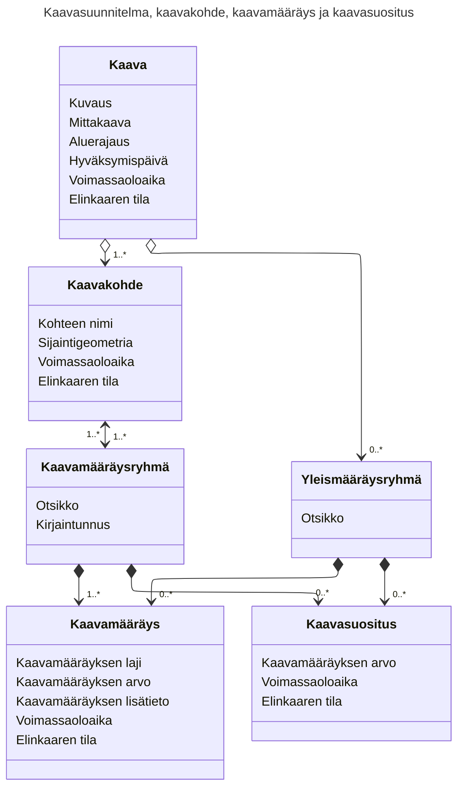
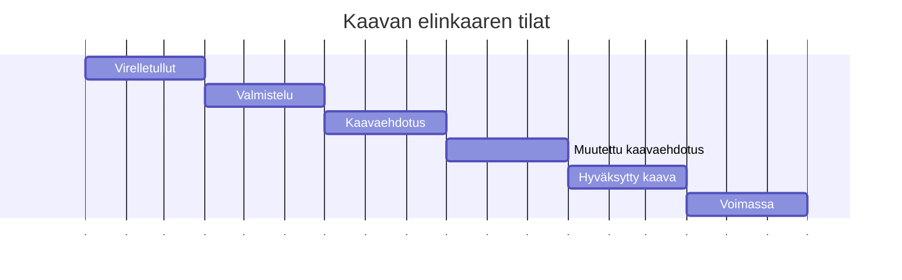
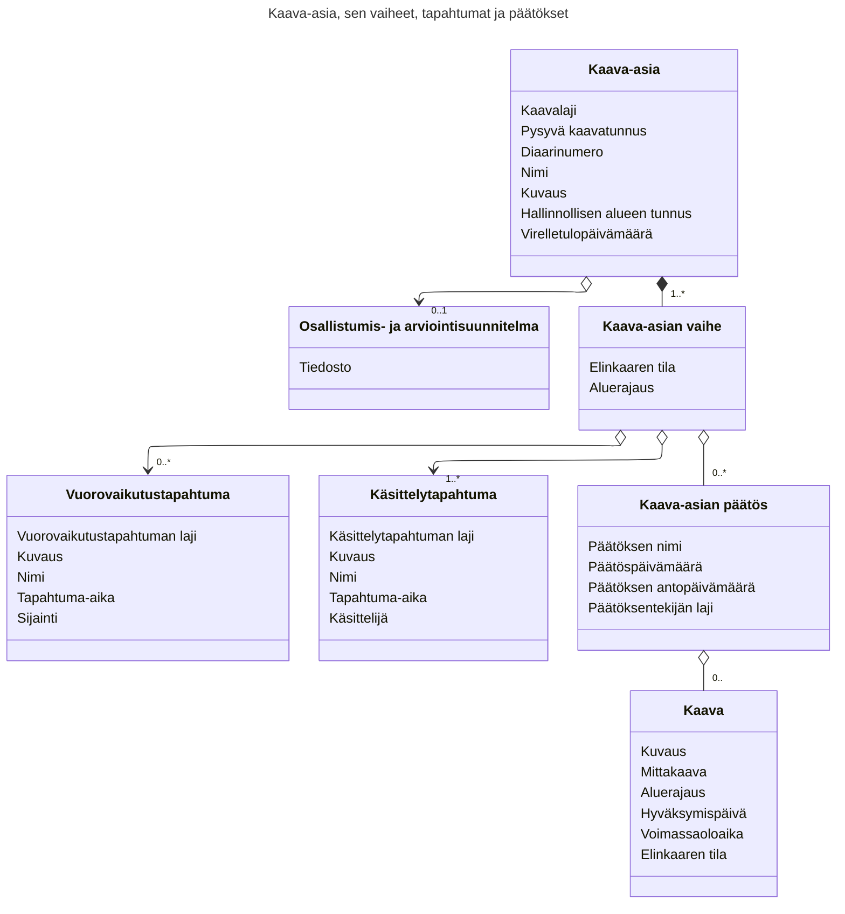

## Kaavatietomalli: perusteiden alkeet

Tietomallimuotoinen kaavoitus edustaa maankäytön suunnittelun digitaalista murrosta. Ennen kaavat tuotettiin ensisijaisesti visuaalisina karttoina ja tekstimuotoisina asiakirjoina (kuten PDF-tiedostoina). Nykyaikaisessa kaavoituksessa kaava ei ole vain kuva, vaan **rakennetun ympäristön standardoitu tietomalli**, jonka tiedot ovat koneellisesti luettavissa, käsiteltävissä ja siirrettävissä järjestelmästä toiseen.

Kaavatietomalli ei muuta kaavoituksen maankäytöllisiä tai juridisia periaatteita, vaan tekee suunnittelun tuloksista täsmällisiä, vertailukelpoisia ja digitaalisen yhteiskunnan tarpeisiin soveltuvia.

Tässä artikkelissa käydään läpi kaavatietomallin keskeisimmät peruskäsitteet ja periaatteet tiivistetysti.


### Mikä on Kaavatietomalli?

Suomen valtakunnallisesti yhteentoimiva Kaavatietomalli määrittelee rakenteen ja säännöt sille, miten kaavatiedot – kuten kaavan alueelliset rajaukset, kaavamääräykset ja kaavaselostukset – kuvataan digitaalisesti.

* **Standardoitu rakenne:** Tietomalli varmistaa, että kaikkien kunnissa ja maakunnissa laadittavien kaavojen tiedot noudattavat yhtenäistä rakennetta.
* **Koodistopohjaisuus:** Merkinnät ja määräykset nojaavat valtakunnallisiin koodistoihin, mikä poistaa tulkinnanvaraisuutta ja yhdenmukaistaa termistöä.
* **Geometrian ja tiedon yhdistäminen:** Jokaiseen kaavakohteeseen kytkeytyy sekä sen spatiaalinen geometria (alue, viiva tai piste) että siihen liittyvät laadulliset ja numeeriset ominaisuudesta vastaavat tiedot.

Kaavatietomalli kentien keskeisin soveltamisalue on Suomen ympäristökeskuksen ylläpitämä Rakennetun ympäristön tietojärjestelmä eli lyhemmin [Ryhti-järjestelmä](https://ryhti.syke.fi/). Yhteinen Kaavatietomalli mahdollistaa rakennetun ympäristön käyttöä ja kehittämistä koskevien suunnitelmien ja päätösten, eli kaavatiedon, yhteiskäytön eri käyttäjien ja tietojärjestelmien kesken.

Kaavatietomalli on niin sanottu loogisen tason tietomalli, josta voidaan tuottaa erilaisi teknisiä toteutuksia sekä tietojärjestelmien sisäiseen kaavatiedon hallintaan ja tallennukseen että eri tietojärjestelmien väliseen kaavatiedon vaihtoon. [Ryhti-järjestelmän rajapintakuvaukset](https://github.com/sykefi/Ryhti-rajapintakuvaukset/) sisältävät erään Kaavatietomallin teknisen toteuksen kaavatiedon siirtämiseksi kuntien ja maakuntien tietojärjestelmistä keskitettyyn kansalliseen Ryhti-järjestelmään ja niide hakemiseksi Ryhti-järjestelmästä. 

### Tietomallin keskeiset rakennuspalikat

Kaavatietomalli koostuu hierarkkisista ja toisiinsa liittyvistä tietokohteista. Tässä kuvataan niistä keskeisimmät.


#### Kaava (kaavasuunnitelma)
Kaava(suunnitelma) toimii kokonaisuuden kehyksenä. Siihen liittyvät yleiset tiedot, kuten:
* Kaavan hyväksymispäivä ja voimassaolotieto.
* Kaavasuunnitelman mittakaava.
* Kaavan elinkaaritila (esim. vireilletullut, ehdotusvaiheessa, hyväksytty, lainvoimainen).
* Alueen maantieteellinen ulottuvuus (kaavan rajaus).
* Kaavaan sisältyvät kaavakohteet ja yleismääräykset.

#### Kaavakohde
Kaavakohde edustaa tiettyä aluetta, viivaa tai pistettä kaavakartalla. Kaavakohde on tapa kohdistaa kaavamääräykset tiettyyn sijaintiin tai alueeseen kaavan maantieteellisen rajauksen sisällä. Sopivia kaavamääräyksiä kaavakohteisiin kohdistamalla saadaan aikaan esimerkiksi seuraavan tyyppisiä kohdistettuja kaavamääräyksiä:
* **Käyttötarkoitusalueet:** Asuinalueet (A), liikealueet (C), teollisuusalueet (T), puistoalueet (VP).
* **Osa-alueet ja rajat:** Rakennusala, suojelualue, kaava-alueen raja.
* **Pistemäiset ja viivamaiset kohteet:** Liittymäkiellot, suojeltavat puut, ajoneuvoliittymät.

#### Kaavamääräykset ja kaavamääräysryhmät
Jokaiseen kaavakohteeseen kytkeytyy yksi tai useampia kaavamääräyksiä. Määräykset voivat koskea muun muassa:
* Kerrosalaa ja tehokkuutta ($e$-luku tai kerrosala $m^2$).
* Kerroslukua ja korkeusasemaa.
* Suojelumääräyksiä, julkisivumateriaaleja tai hulevesien hallintaa.

Tietomallissa määräys ei ole pelkkää vapaamuotoista tekstiä, vaan se esitetään tietomallin kuvaamassa rakenteisessa määrämuodossa. Kaavan yksittäisen kaavamääräyksen tiedot voivat koostua useammasta koneluettavasta kentästä: kaavamääräyksen laji, määräyksen arvo, lisätieto mahdollisine omine arvoineen. Sanallisten kaavamääräysten avulla voidaan kuitenkin aina tarvittaessa kuvata määräyksen sisältö tekstiä, elleivät kenttien koneluettavat kentät riittävän hyvin taivu spesifiseen määräystarpeeseen. 

Kaavatietomallissa kaavamääräykset kootaan yhden tai useamman määräyksen kaavamääräysryhmiksi, joiden kautta kohdistaminen kaavakohteisiin tehdään. Kaavamääräysryhmille voidaan antaa otsikko ja kaavakartalla näkyvä kirjaintunnus. 



### Kaavahanke ja sen vaiheet: Kaava-asia

Kaavatietomallin avulla voidaan kuvata kaavasuunnitelman lisäksi myös kaavahankkeen tai -prosessin yleistiedot ja vaiheet:

* Kaavan nimi, tunnus ja kaavalaji (asemakaava, yleiskaava, maakuntakaava).
* Kaavan pysyvä valtakunnallinen tunnus sekä sisäiset asianhallinta- ja diaaritunnukset.
* Tieto hallinnollisesta alueesta, johon kaava kuuluu (kunta tai maakunta).
* Kaavan osallistumis- ja arviointisuunnitelma.
* Kaava-asian ajalliset vaiheet ja vaiheesta toiseen siirtymiseen liittyvät hallinnolliset päätökset.

Kaavatietomallissa kaava-asian elinkaaren vaiheet on vakioitu. Seuraavassa on esitetty tyypillisimmät kaavan elinkaaren tilat ajallisessa järjestyksessä:



Kaavatietomallissa jokaisella kaavasuunnitelman versiolla ja niiden sisältämillä kaavakohteillä ja -määräyksillä on tilatieto (elinkaaren tila). Kaava-asiaan liitetään prosessin kuluessa kunkin vaiheen tiedot kaavasuunnitelmineen ja asiakirjoineen. Tämä mahdollistaa kaavan tarkastelun myös kaavaprosessin aikana, esimerkiksi sen ollessa julkisesti nähtävillä. Kaavan elinkaaren vaiheiden avulla on myös helppo nähdä onko kaava hyväksytty, onko valitusaika vielä kesken, onko se lainvoimainen ja mahdollisesti kokonaan tai osittain kumottu.



### Tietomallimuotoinen kaavatieto mahdollistaa paljon

1. **Yhteentoimivuus:** Mahdollistaa saumattoman tiedonvaihtamisen kuntien ja maakuntien CAD-pohjaisten suunnitteluohjelmistojen, paikkatietojärjestelmien (GIS), Rakennetun ympäristön tietojärjestelmän (Ryhti) sekä muiden viranomais- ja yksityissektorin järjestelmien kesken.
2. **Automaatio ja analysoitavuus:** Kun kaavamääräykset ja niiden arvot ovat koneluettavia ja paikkatiedoksi kuvattuna, voidaan kaavojen vaikutuksia ja rakennusoikeutta laskea sekä simuloida automaattisesti.
3. **Sujuvampi luvitus:** Rakennusvalvonta voi hyödyntää suoraan koneluettavaa kaavatietoa rakennuslupahakemusten kaavanmukaisuuden tietokoneavusteisessa arvioinnissa  tarkastuksessa ja käsittelyssä.
4. **Tekoälyavusteinen suunnittelu:** Laajamittaisesti sekä kone- että ihmisymmärrettävään muotoon tuotettu alueidenkäytön suunnittelutieto mahdollistaa tekoälyavusteisten suunnitteluohjelmistojen kouluttamisen kattavilla ja realistisilla aineistoilla. Alueellisia, haastaviakin suunnittelutarpeita ja tavoitteita kuvaavat kaavaselostukset yhdessä niiden ratkaisemiseen tuotettujen, koneluettavien kaavatietojen kanssa mahdollistavat parhaiden kaavoituskäytäntöjen ja -ratkaisumallien opettamisen kaavoituksen erikoistuneille tekoälymalleille.


## Kaavatietomallin rakenne ja sisältö tarkemmin

Valtakunnallisesti yhteentoimivan tietomallimuotoisen kaavatiedon tietomalli, eli lyhyemmin Kaavatietomallin tietorakenteet ja -sisällöt on määritelty DVV:n ylläpitämällä Yhteentoimivuusalustalla: Tietomallin rakenteet [Tietomallit-työkalussa](https://tietomallit.suomi.fi/), ja siinä käytetyt koodistot [Koodistot-työkalussa](https://koodistot.suomi.fi/).

Kaavoittajat eivät yleensä suoraan käytä Yhteentoimivuusalustan tietomäärityksiä, koska Kaavatietomallin mukaisten kaavojen laadintaan käytettävät suunnittelusovellukset on valmiiksi ohjelmoitu noudattamaan tietomallin määrityksiä. Tässä osiossa Kaavatietomallia käsitellään hieman teknisemmin, mikä saattaa kiinnostaa erityisesti Kaavatietomallin käyttöön perustuvien tietojärjestelmien suunnitelijoita ja kehittäjiä.

### Kaavatietomallin määrittely: UML-luokkamalli ja Yhteentoimivuusalusta

Yhteentoimivuusalustan [Tietomallit-työkalussa](https://tietomallit.suomi.fi/model/rytj-kaava) Kaavatietomalli on määritely luokkamallin avulla. Kukin luokka esittää tietomallin kuvaamaa käsitettä tai rakenteista, useammasta tieto-osasta koostuvaa ominaisuutta. Kullakin luokalla on nimi ja lista ominaisuuksia, eli attribuutteja, joilla on nimen lisäksi tietotyypin ja moninkertaisuustiedot. Lisäksi luokkamallissa on esitetty mahdolliset luokkien väliset yhteydet. Myös näistä assosiaatioista on kuvattu yhteyden nimen lisäksi sen moninkertaisuus, eli voiko kyseisiä yhteyksiä olla samaan aikaan yksi vai useampi. Moninkertaisuuden avulla määritellään myös pakolliset attribuutit ja assosiaatiot: pakollisten tietojen monikertaisuus on yksi tai useampi.

Yhteentoimivuusalustalla luokkamalli esitetään graafisesti luokkakaaviona, jonka muoto ei kuitenkaan ole täysin tietojärjestelmien ja tietomallien standardoinnissa käytettävän [Unified Modeling Language -kielen (UML)](www.uml.org) mukainen, mistä aiheutuu tiettyjä hankaluuksia tietomallin tulkinnassa. Toisaalta näin on vältetty UML-standardin graafisen luokkakaavion mahdolliset monimutkaisuudet. Lopputulos on tyypillinen kompromissi, joka on sekä maalikolle että tietomallinnuksen ja ohjelmoinnin ammattilaiselle hieman luotaantyöntävä: ensimmäiselle liian monimutkainen ja jälkimmäiselle liian epätäsmällinen.

Kaavatietomalli on alunperin määritely käyttäen paikkatiedon tiedonmallinnusstandardeja: Se perustuu [ISO 19109-standardin](https://www.iso.org/standard/59193.html) yleiseen kohdetietomalliin (General Feature Model, GFM), joka määrittelee rakennuspalikat paikkatiedon ISO-standardiperheen mukaisten sovellusskeemojen määrittelyyn. GFM kuvaa muun muassa metaluokat *FeatureType*, *AttributeType* ja *FeatureAssociationType*. Lisäksi tietomalli perustuu muihin paikkatiedon ISO-standardeihin, joista keskeisimpiä ovat [ISO 19103](https://www.iso.org/standard/56734.html) (UML-kielen käyttö paikkatietojen mallinnuksessa), [ISO 19107](https://www.iso.org/standard/66175.html) (sijaintitiedon mallintaminen) ja [ISO 19108](https://www.iso.org/standard/26013.html) (aikaan sidotun tiedon mallintaminen).

Valitettavasti UML-kielellä laadittua alkuperäistä luokkamallia ei ole voitu täysin siirtää Yhteentoimivuusalustan Tietomallit-työkaluun, joka ei tue kaikkia UML-luokkamallin ominaisuuksia. Kaavatietomallin määrittely Yhteentoimivuusalustalla ei siis ole täysin paikkatiedon kansainvälisten standardien mukainen, vaan tietynlainen hybridi: Toisaalta lähempänä käsitemallia (mm. sijaintigeometrioiden määrittely on puutteellinen, eikä vastaa paikkatierdon ISO-standardien kuvaustapaa), toisaalta loogisen tason tietomalliksi liiankin yksityiskohtainen sisältäen mm. luokkien avain-attribuutit, jotka on mallinnettu suoraan Ryhti-järjestelmän JSON-rajapintakuvausten OpenAPI-komponenttien UUID-tunnisteista.

ISO-paikkatietostandardien mukainen UML-kielinen Kaavatietomalli, samoin kuin esimerkiksi rakentamisen sitovan tonttijaon, rakennusjärjestyksen ja rakentamisen lupapäätösten tietomallit, oli vuoden 2023 syksyyn saakka saatavilla Syken ylläpitämällä tietomallit.ymparisto.fi -sivustolla, joka on sittemmin ajettu alas. Kopio tietomallit.ymparisto.fi -sivustosta löytyy edelleen Spatineon ylläpitämältä [ry-tietomallit -sivustolta](https://spatineo.github.io/ry-tietomallit/). Kaavatietomallin osalta sivustolta löytävät mm. seuraavat tiedot (huom, tietoja ei ole päivitetty vastaamaan myöhempiä tietomallin muutoksia):

* [UML-luokkakaavio](https://spatineo.github.io/ry-tietomallit/kaavatiedot/v1.1/looginenmalli/uml/doc/)
* [Sanallinen dokumentaatio](https://spatineo.github.io/ry-tietomallit/kaavatiedot/v1.1/looginenmalli/dokumentaatio/) (ns. feature catalog)
* [Elinkaari-](https://spatineo.github.io/ry-tietomallit/kaavatiedot/v1.1/looginenmalli/elinkaarisaannot.html) ja [laatusäännöt](https://spatineo.github.io/ry-tietomallit/kaavatiedot/v1.1/looginenmalli/laatusaannot.html) sisältäen selkeät vaatimusmäärittelyt.
* Kaavatietomallin [asemakaavan](https://spatineo.github.io/ry-tietomallit/kaavatiedot/soveltamisprofiili/asemakaava/v1.0/) ja [yleiskaavan](https://spatineo.github.io/ry-tietomallit/kaavatiedot/soveltamisprofiili/yleiskaava/v1.0/) soveltamisprofiilit, jotka tarkentavat koodistojen käyttöä ja kaavamääräysten muodostamista.

Nämä tiedot on nykyisin pääosin esitetty Syken [Rakennetun ympäristön tietojärjestelmä -sivustolla](https://ryhti.syke.fi/), pois lukien luokkamalli, joka on kuvattu Yhteentoimivuusalustalla, kuten edellä on kerrottu. Syken tietomallikuvauksen päätarkoitus on kuitenkin selkeästi Ryhti-järjestelmän kuvauksessa. Seuraavat osiot Syken ryhti.syke.fi -sivuston dokumentaatiossa ovat olennaisia Ryhti-järjestelmän Kaavatietomallin toteutuksen ymmärtämisessä:

* [Ryhti-järjestelmän yleiset tietomääritykset ja laatusäännöt](https://ryhti.syke.fi/ohjeet-ja-tuki/tietomallit/tietotyypit/)
* [Ryhti-järjestelmän kaavatietomallin tietomääritykset ja kuvaukset](https://ryhti.syke.fi/alueidenkaytto/tietomallimuotoinen-kaavoitus/kaavatietomallin-tietomaaritykset/)
* [Kaavatietomallin elinkaari- ja laatusäännöt](https://ryhti.syke.fi/alueidenkaytto/tietomallimuotoinen-kaavoitus/kaavatietomallin-elinkaari-ja-laatusaannot/)
* [Kaavasuunnitelman validointisäännöt](https://ryhti.syke.fi/alueidenkaytto/tietomallimuotoinen-kaavoitus/kaavasuunnitelman-validointisaannot/)
* [Kaavatiedon validointisäännöt ja paluuarvot](https://ryhti.syke.fi/wp-content/uploads/sites/2/2023/11/Kaavatiedon-validointisaannot-ja-paluuarvot.pdf) (Ryhti-järjestelmän kaavatiedon validointipalvelu, PDF)
* [Kaavakartan GeoTIFF-vaatimukset](https://ryhti.syke.fi/alueidenkaytto/tietomallimuotoinen-kaavoitus/kaavatietomallin-elinkaari-ja-laatusaannot/kaavakartan-geotiff-vaatimukset/)

Seuraavissa luvuissa on esitetty Kaavatietomallin keskeisimmät luokat yksityiskohtaisemmin Yhteentoimivuusalustalla kuvatun luokkamallin mukaisesti.

### Kaava-asia, sen vaiheet ja päätökset

Kaava-asia-luokka kuvaa kaavahankkeen perustiedot, muun muassa minkätyyppinen kaava on kyseessä, minkä kunnan tai maakunnan hallinnolliselle alueelle se on laadittu, minkä niminen kaava on, milloin kaava on tullut vireille, onko kyseessä alunperin tietomallimuotoon laadittu kaava vai onko kyseessä aiemman, perinteisen kaavan digitointi Kaavatietomallin muodoon. Kaava-asia ei sisällä suunnitelmatietoja, mutta siihen voidaan liittää kuvauksia käytetyistä lähtötietoaineistoista ja osallistumis- ja arviointisuunnitelma, kaavahankkeen vastuutahon nimi ja erilaisia hankkeeseen liittyviä asiakirjoja. Kaava-asian tietoihin kuuluu kaavan pysyvä tunnus, joka haetaan Ryhti-järjestelmän kautta kaavahankkeen alussa. 

Kaava-asiaan liittyy aina vähintään yksi Kaava-asian vaihe, tyypillisesti ensimmäisen vaiheen elinkaaren tila on *Vireillä* tai *Valmistelu*. Kuhunkin vaiheeseen puolestaan liitetään vähintään yksi sen aloittanut käsittelytapahtuma, kuten nähtäville asettamisesta tai hyväksymisestä päättäminen. 

Käsittelytapahtuman lisäksi Kaava-asian vaiheeseen liitetään yleensä myös käsittelytapahtumassa tehdyn päätöksen tiedot, vähintään päätöksen laji (attribuutti *Päätöksen nimi*), päätöksen tekijän laji, ja päivämäärätiedot. Kaavatietomallin nykyisessä versiossa kukin vaiheen alun tilanne kaavasuunnitelmasta, eli kaavakohteista ja niihin kohdistetuista kaavamääräyksistä, liittyy kaavan vaiheeseen aina Kaava-asian päätös -luokan kautta. Tällä Ryhti-järjestelmän suunnittelun ja toteuksen aikana tehdyllä muutoksella on haluttu tehdä selväksi, että Ryhti-järjestelmään vietäviea suunnitelmien tulee aina sellaisia versioita, josta on kunnassa tai maakunnassa tehty jokin päätös. 

Kaavatietomallin aiemmissa suunnitteluversioissa Kaava-asian ja kaavasuunnitelman tiedot oli kuvattu yhdellä Kaava-luokalla, jonka elinkaaren tila päivittyi kaavaprosessin edetessä. Kaava-luokkaan siihen liittyi sen elinkaaren aikana useampia päätöksiä ja tapahtumia ja sen kuvaamaan kaavasuunnitelman sisältö eli prosessin mukana. Kaikki kaavaan tehtävät muutokset voitiin jatkuvasti tallentaa kaavatietovarantoon, ja järjestelmä huolehtii muutostenhallinnasta ja tietojen versionnista: Esimerkiksi siirryttäessä uuteen kaavan elinkaaren vaiheeseen aiemman elinkaaren vaiheen viimeisin tila koko kaavasta tallennetaan siten, että siihen voidaan tarvittaessa palata. 

Ryhti-järjestelmään tallentamisen selkeyttämiseksi Kaavatietomalliin halutiin rakenne, jossa kunta tai maakunta tuo erikseen Ryhtiin hankkeen perustiedot (Kaava-asia ja ensimmäinen vaihe) ja myöhemmin erillisinä kokonaisuuksinaan yhden vaiheen kokonaisen kaavasuunnitelman uusine, aiemmista suunitelman vaiheista erillisine kaavakohteineen ja -määräyksineen. Tässä siis luovuttiin myös mahdollisuudesta kaavakohde- ja kaavamääräyskohtaisen muutoshistorian kuvaamiseen: Vaikka jokin kaavakohde ja siihen kohdistuvat kaavamääräykset olisivat täysin identtisiä esimerkiksi kaavaehdotusvaiheessa ja lopullisessa hyväksyssä kaavassa, ne kuvataan tietomallissa erillisinä, eri vaiheisiin liittyviä kopiotietoina, joden välillä ei ole tietomallissa mitään yhteyttä. Tämä toki helpottaa kaavan teknistä tiedonhallintaa siinä mielessä, että kukin kaavan vaiheen mukainen kaavasuunnitelma sisältää täydelliset tiedot kaikista sen kaavakohteista ja -määräyksistä ilman tarvetta viitata muuttumattomien tietojen osalta aiemmassa vaiheessa tallennettuihin versioihin suunnitelmaan kuuluvista kaavakohde- ja kaavamääräystiedoista.

Nykyisen, Ryhti-järjestelmään toteutetun Kaavatietomallin mukaiset kaava-asian, sen vaiheiden ja päätösten attirubuutit ja luokkien keskinäiset suhteet on esitetty alla olevassa UML-luokkakaaviossa:

```data-model-snippet
    title: Kaava-asia, Kaava-asian vaihe ja Kaava-asian päätös
    modelId: rytj-kaava-1.0.5
    classes:
        - "https://iri.suomi.fi/model/rytj-kaava/Kaava-asia"
        - "https://iri.suomi.fi/model/rytj-kaava/Kaava-asianVaihe"
        - "https://iri.suomi.fi/model/rytj-kaava/Kaava-asianPaatos"   
```

Kaaviossa on selkeyden vuoksi esitetty kokonaisuudessaan vain nämä kolme luokkaa ja niiden attribuuteissa käytetyt koodistot (stereotyyppi *codelist*). Näiden kolmen luokan assosiaaatiot muihin tietomallin luokkiin on myös esitetty, mutta näiden liittyvien luokkien yksityiskohtia ei. 

### Kaavasuunnitelma, kaavakohteet ja kaavamääräykset


```data-model-snippet
    title: Kaava, Yleismääräysryhmä, Kaavakohde, Kaavamääräysryhmä, Kaavamääräys, Kaavamääräyksen lisätieto ja Kaavasuositus 
    modelId: rytj-kaava-1.0.5
    classes:
        - "https://iri.suomi.fi/model/rytj-kaava/Kaava"
        - "https://iri.suomi.fi/model/rytj-kaava/Yleismaaraysryhma"
        - "https://iri.suomi.fi/model/rytj-kaava/Kaavakohde"
        - "https://iri.suomi.fi/model/rytj-kaava/Kaavamaaraysryhma"
        - "https://iri.suomi.fi/model/rytj-kaava/Kaavamaarays"
        - "https://iri.suomi.fi/model/rytj-kaava/KaavamaarayksenLisatieto"
        - "https://iri.suomi.fi/model/rytj-kaava/Kaavasuositus"
```

```data-model-snippet
    title: Ominaisuuden arvo ja sen aliluokat
    modelId: rytj-kaava-1.0.5
    classes:
        - "https://iri.suomi.fi/model/rytj-kaava/OminaisuudenArvo"
        - "https://iri.suomi.fi/model/rytj-kaava/NumeerinenArvo"
        - "https://iri.suomi.fi/model/rytj-kaava/NumeerinenArvovali"
        - "https://iri.suomi.fi/model/rytj-kaava/Korkeusvali"
        - "https://iri.suomi.fi/model/rytj-kaava/Korkeuspiste"
        - "https://iri.suomi.fi/model/rytj-kaava/Koodiarvo"
        - "https://iri.suomi.fi/model/rytj-kaava/Tekstiarvo"
```