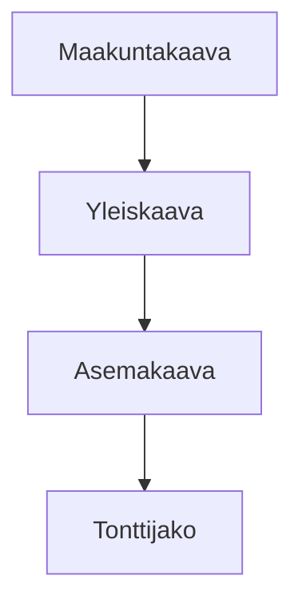

# Suomalaisen kaavoituksen tietomallit

Tällä sivulla esittelemme kansalliset tietomallit eri kaavatasoille.

## Hierarkia

## Standardointi

Kaikki mallit perustuvat kansalliseen koodistoon ja yhteisesti sovittuun skeemaan, joka varmistaa, että tieto liikkuu saumattomasti kuntien ja valtion järjestelmien välillä.
