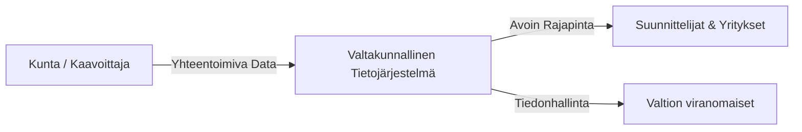

# Ryhti muuttaa käytännöt

Ryhti-hankkeen tavoitteena on luoda valtakunnallinen rakennetun ympäristön tietojärjestelmä (RYTJ). Tämä tarkoittaa siirtymistä PDF-pohjaisista kaavakuvista koneluettavaan vektori- ja ominaisuustietoon.

## Tietovirran arkkitehtuuri

## Hyödyt

1. **Läpinäkyvyys**: Kaikkien kuntien kaavatiedot löytyvät samasta paikasta samassa muodossa.
2. **Nopeus**: Suunnittelutarve- ja poikkeamispäätökset nopeutuvat, kun pohjatieto on vakioitua.
3. **Innovaatiot**: Yritykset voivat kehittää uusia palveluita avoimen datan päälle.

Tämä on suurin muutos suomalaisessa kaavoituksessa vuosikymmeniin.
