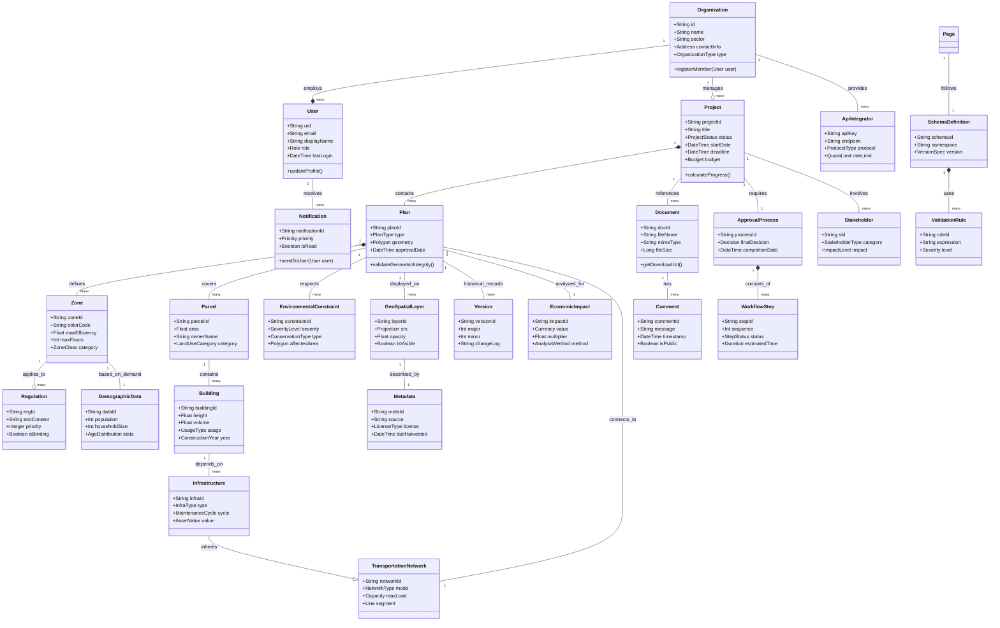

Nykyaikainen kaupunkisuunnittelu vaatii äärimmäisen tarkkoja ja monitasoisia tietomalleja. Tässä esimerkissä tarkastelemme visualisoituna, miltä näyttää kansallisen tason kaavoitusjärjestelmän ydinrakenne, kun siihen integroidaan niin kiinteistötiedot, ympäristörajoitteet kuin viranomaisprosessitkin.

Alla oleva kaavio havainnollistaa järjestelmän monimutkaisuutta. Voit klikata kaaviota avataksesi sen koko ruudun näkymään, jossa voit tarkastella yksittäisiä luokkia ja niiden suhteita tarkemmin.

Tämä arkkitehtuuri mahdollistaa saumattoman tiedonkulun eri sidosryhmien välillä, varmistaen että jokainen päätös perustuu ajantasaiseen ja vahvasti tyypitettyyn dataan.
