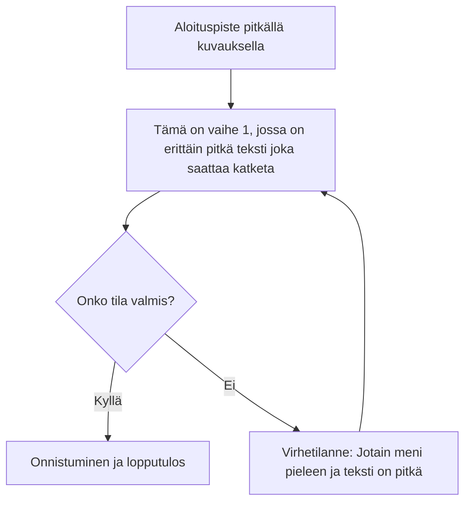
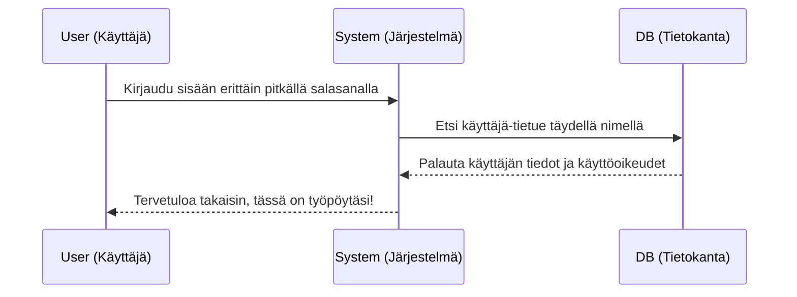
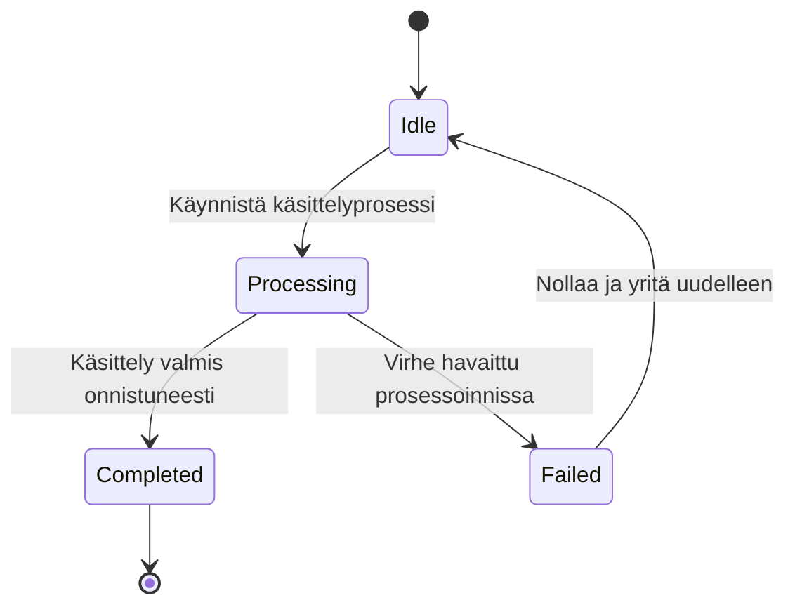
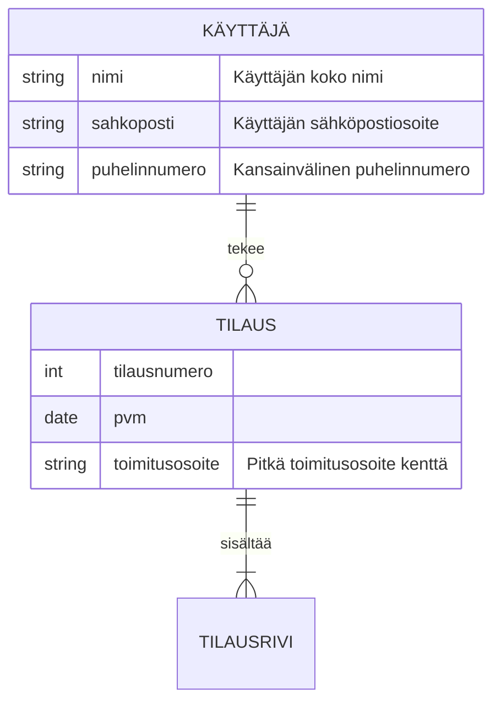
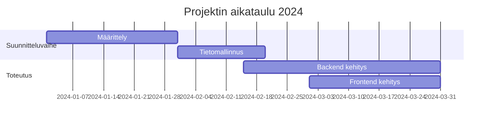
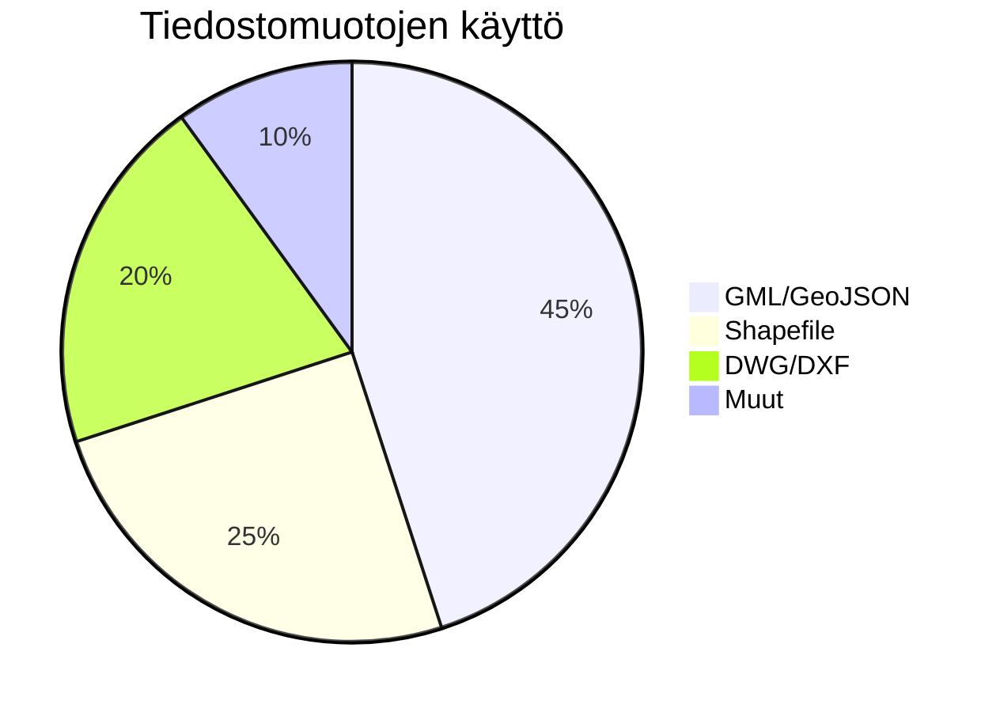
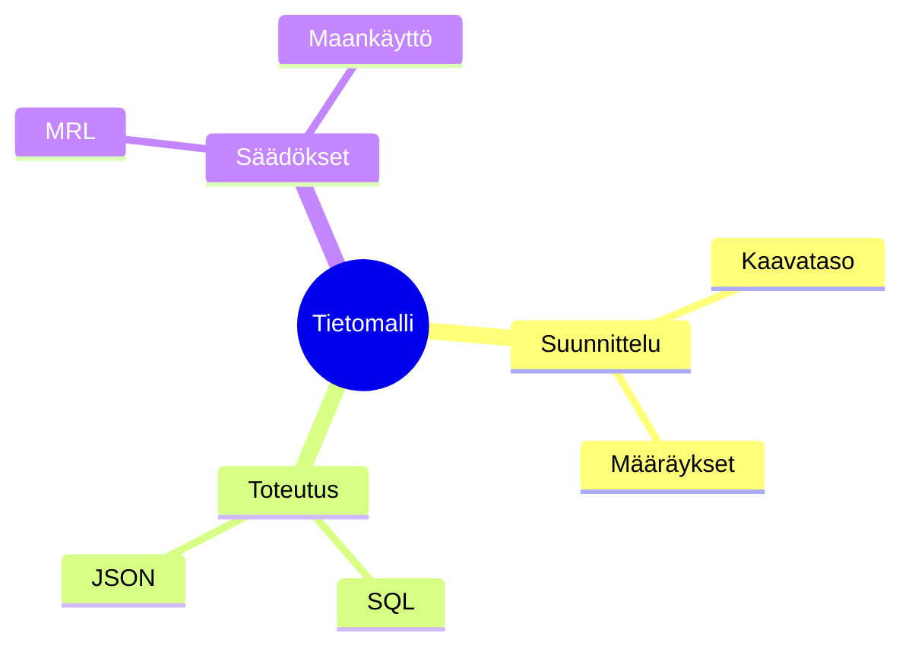
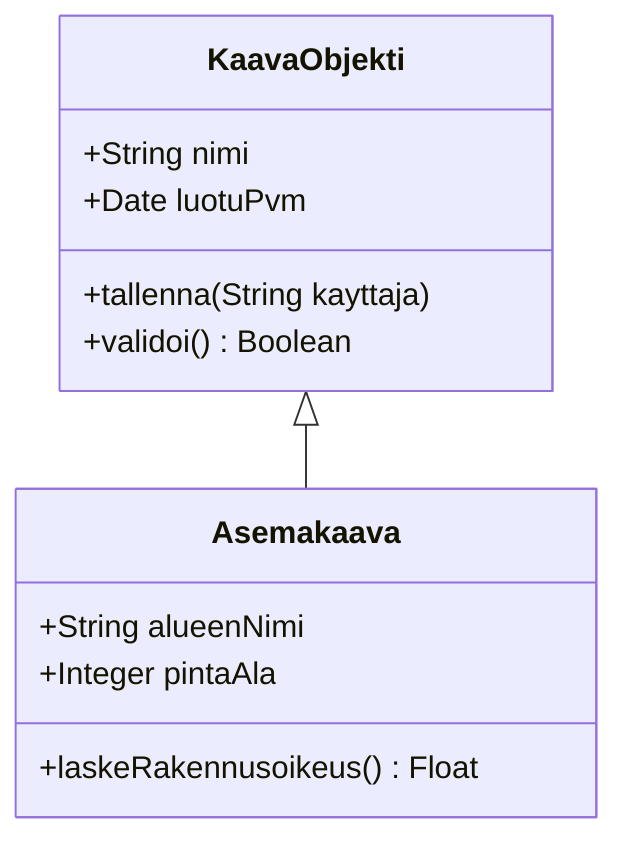

Tämä sivu sisältää useita eri tyyppisiä Mermaid-kaavioita. Käytämme näitä varmistaaksemme, että fonttien renderöinti ja tekstien näkyminen on oikeellista eri diagrammityypeillä. Erityistä huomiota kiinnitetään tekstien katkeamiseen (truncation) laatikoiden reunoilla.

## 1. Flowchart (Vuokaavio)

Testataan pitkiä tekstejä ja erikokoisia solmuja.



## 2. Sequence Diagram (Sekvenssikaavio)

Sekvenssikaavioissa on usein paljon tekstiä nuolten päällä.



## 3. State Diagram (Tilakaavio)



## 4. Entity Relationship Diagram (ER-kaavio)

ER-kaaviot ovat usein monimutkaisia ja niissä on paljon attribuutteja.



## 5. Gantt Chart (Gantt-kaavio)



## 6. Pie Chart (Piirakkakaavio)



## 7. Mindbox / Mindmap



## 8. Class Diagram (Luokkakaavio)

Luokkakaaviot ovat olleet ongelmallisia. Tässä testataan niitä uudelleen.



## 9. Instanssikaavio

Instanssikaavio on toteutettu muuntamalla koodi flowchart LR kaaviotyypin ymmärtämään muotoon ja hyödyntämällä sen kustomoitavaa HTML-sisältöä:

```instance

  instance alice : User {
    id = 101
    role = "ADMIN"
  }

  instance acc99 : Account {
    balance = 5000.00
    status = "ACTIVE"
  }

  instance ord1 : Order {
    total = $149.99
  }

  alice <-> acc99 : owner | account
  alice -> ord1 : places
```