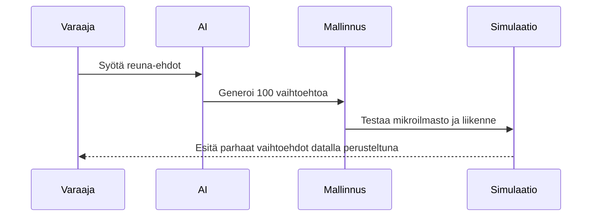

# Tekoäly avustajana

Tulevaisuudessa kaavoittaja ei enää aloita tyhjältä pöydältä. Tekoäly pystyy generoimaan useita eri vaihtoehtoja kaavaluonnoksiksi annettujen reuna-ehtojen (kuten väestönkasvu, hiilineutraaliustavoitteet ja liikennevirrat) perusteella.

## Simulaatiot päätöksenteon tukena

## Digitaaliset kaksoset

Kansallinen kaavatietomalli integroituu saumattomasti kaupunkien digitaalisiin kaksosiin (Digital Twins). Tämä mahdollistaa kaavan vaikutusten arvioinnin reaaliajassa jo luonnosvaiheessa.

Tämä kehitys ei poista poliittista päätöksentekoa, mutta se tarjoaa sille paremman ja tarkemman tietopohjan.
